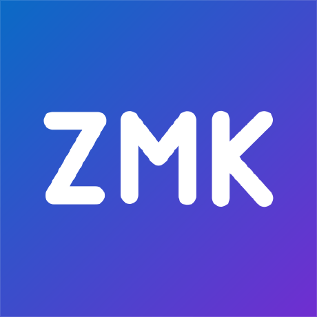

# Softwares de Customização - Teclado Tergo Sofle

## Versão Padrão (com fio)

Disponível para uso [diretamente no navegador](https://vial.rocks/) ou [download](https://get.vial.today/download/).

Além dos nosso manuais, você pode ter uma visão geral dele [clicando aqui](https://get.vial.today/).

## Versão Wireless (sem fio)

Disponível para uso [diretamente no navegador](https://zmk.studio/) ou [download](https://github.com/zmkfirmware/zmk-studio/releases/).

Além dos nosso manuais, você pode ter uma visão geral dele [clicando aqui](https://zmk.dev/docs/features/studio).
