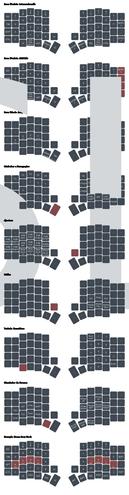

# Tergo Sofle - Manual de Usuário

## Resumo

Neste manual você vai saber os aspectos importantes para utilizar seu teclado Tergo Sofle.

> [!TIP]
>
> Veja o sumário de cada guia clicando no ícone de lista na parte superior direita da página - 

## Aproveite sua jornada!

Com um passo de cada vez, entenda cada aspecto do seu teclado.

Os guias te ajudarão e estão super detalhados, para que você desfrute do máximo potencial de cada aspecto do seu teclado.

## Instalação

Seu teclado já vem com os cabos necessários para o funcionamento.

- Conecte os lados com o cabo USB-C para C (conectores laterais);

- Conecte o lado esquerdo do teclado ao computador com o outro cabo USB-C ao seu computador (conector fêmea da parte de cima);

A imagem abaixo mostra um exemplo da disposição dos cabos:


### Adicione o teclado ao seu sistema operacional

O teclado por padrão segue o padrão internacional, mas pode ser usado também no padrão ABNT2 (mais abaixo te mostraremos).

Para que seja reconhecido no seu computador, você precisa adicionar o layout de teclado internacional.

[Clique aqui](https://www.youtube.com/watch?v=UWwcIcwkPlA) para ver um breve vídeo de como fazer isso no Windows 11, por exemplo.

## Layout de teclas

### Padrão (Internacional)


As teclas com a letra `L` seguida de um número (como o `L2`) indicam teclas que ao serem seguradas mudam a camada de teclas do seu teclado.

O conceito de camada de teclas será explicado mais abaixo neste manual.

### Como fazer acentos e teclas especiais?

Para acentos agudos, no padrão internacional, basta clicar a tecla de aspas e então a letra que quer.

Para o `Ç`, clique na tecla de aspas e na letra `C`.

Para o símbolo de til (`~`), segure a tecla `Fn` (tecla do dedão esquerdo) e clique `A`. Em seguida, você pode largar a tecla segurada e clicar na letra que deseja.

Para o símbolo grave (``` ` ```), segure a tecla `Fn` (tecla do dedão esquerdo) e clique `Q`. Em seguida, você pode largar a tecla segurada e clicar na letra que deseja.

[Clique aqui](https://youtu.be/r9vUzQyXdps?t=142) para ver um breve vídeo que demonstra como usar teclas no padrão internacional.

### Mudar para o padrão brasileiro ABNT2

Caso prefira, você pode mudar para o padrão ABNT2.

Note que o layout de teclas padrão do seu teclado é o Internacional.

Caso queira usar o seu teclado com layout no padrão Português (Brasil) ABNT2, [clique aqui](./guias/especifico_versao_padrao/COMO_USAR_LAYOUT_PORTUGUES_BRASIL_ABNT.md) para saber como.

Mudando para o padrão brasileiro, as teclas abaixo em vermelho são as que mudam em relação ao layout internacional que vem por padrão.


## Vial: Software para configuração


O teclado usa a interface para configurações em tempo real [Vial](https://get.vial.today/).

Você pode utilizar o [Vial no próprio navegador](https://vial.rocks/) ou [baixar o aplicativo do Vial](https://get.vial.today/download/) para seu sistema operacional. Em ambos os casos, espere seu teclado ser reconhecido no software e o selecione. As modificações são feitas em tempo real.

_Caso use Linux e o Vial não esteja conectando como esperado, pode ser necessário fazer [este](https://get.vial.today/manual/linux-udev.html) passo adicional._

Aproveite e já abra o Vial, e navegue pelas camadas de teclas para entender a posição de cada tecla em cada camada. Não se assuste, é mais simples do que parece.

Não se preocupe em entender agora o que cada menu do Vial faz. Te explicaremos aos poucos nos próximos guias, como o de [modificações e funcionalidades que contribuem para ergonomia](./guias/MODIFICACOES_E_FUNCIONALIDADES_QUE_CONTRIBUEM_PARA_ERGONOMIA.md).

Com o [Vial](https://get.vial.today/), você tem funcionalidades diversas. Algumas das principais que você provavelmente utilizará são:

- Ver o mapeamento de cada tecla;
- Modificar o que cada tecla faz;
- Modificar camadas;
- Configurar o RGB;
- Configurar variáveis específicas de funcionalidades do firmware QMK;
- Entre outros.

Se tem uma ideia em mente que não está documentada ou não encontrou, pode entrar em contato conosco que te ajudo e adiciono à documentação.

## Telas OLED

As telas OLED não só oferecem um visual único mas também possuem utilidades.

Na tela esquerda, é possível visualizar qual é a camada base do teclado, a camada atual ativa, e se teclas especiais como o capslock estão ativas.


Desfrute delas para te ajudar principalmente a entender o sistema de camadas.

Também, na tela direita, quando você está na camada de ajuste, você verá variáveis relacionadas ao RGB e a versão do firmware do teclado.


## Camadas de teclas

O sistema de camada de teclas faz com que todas as teclas do teclado estejam acessíveis em outras camadas.

Perceba que diversas teclas especiais, a princípio, não se encontram na camada base do seu teclado, mas sim em outras camadas. Essas teclas podem ser: símbolos especiais, F1-F12, botões de navegação e setas.

Isso justamente porque esses botões costumam ficar em posições mais distantes, que requerem bastante movimento para serem alcançadas.

Com o sistema de camada de teclas, elas ficam mais próximas de você, a uma camada de distância.

É parecido como a tecla Shift funciona no seu teclado tradicional. Quando você segura o Shift, as teclas que são números assumem uma nova funcionalidade: símbolos. E as letras normais viram maiúsculas.

A diferença é que você pode programar o que quer ver em cada camada: configure uma tecla para mudar de camada e configure o que você quer de teclas nessa camada.

Use a interface do Vial para entender facilmente o conteúdo de cada camada e use a foto de exemplo abaixo para se guiar!

As camadas que já vem com o seu teclado são:
- camada base
- símbolos e navegação
- controle de mídia
- simulador de mouse
- teclado numérico
- ajustes

Veja o exemplo abaixo:



### Utilize as telas OLED para se guiar

Você também pode, a partir da camada de "ajustes", clicar a tecla "B" para mudar o conteúdo das telas e ver exatamente o número das camadas ao invés dos textos, o que pode ajudar você a entender melhor em qual camada seu teclado está quando estiver configurando suas camadas.

### Modo básico e adepto

O modo básico e adepto são simplesmente aplicações do sistema de camada de teclas.

O Tergo Sofle vem configurado de forma que você pode escolher entre 3 camadas base, ou seja, a camada que fica ativa quando você não está com nenhuma outra camada ativa, ou seja, onde estão suas letras e números convencionais.

Essas camadas são as de número 0, 1 e 2 (que podem ser visualizadas facilmente no Vial).

A camada 0, também chamada de "Basic", é a padrão.

A camada 1, também chamada de "Adept", é uma extensão da camada 0, que vem configurada com novas funcionalidades especiais mais avançadas.

A camada 2 é uma camada extra para você modificar do jeito que quiser. É uma cópia da camada 0.

### Funcionalidades que já vem configuradas no modo adepto (camada 1)

O modo adepto muda qual é a camada base. 

Você pode colocar o que quiser na camada que corresponde ao modo adepto (camada 1), mas ela é chamada assim pois já vem com funcionalidades interessantes configuradas que devem tornar sua experiência de digitação ainda mais avançada.

Essas funcionalidades consistem de teclas com comportamentos especiais que visam uma experiência ainda mais ergonômica e avançada de digitação. Em destaque, ele adiciona teclas com:

- Duplo comportamento para a tecla espaço (também conhecido como Tap-Hold) para ir à camada do simulador de mouse se segurada;

- Comportamento Tap-Hold nas teclas da Home Row para utilização de modificadores.

Não se assuste! Te explicamos tudo. Um passo por vez.

Recomenda-se que você explore o restante do manual e, em seguida, o [guia de como digitar com ergonomia](./guias/COMO_DIGITAR_COM_ERGONOMIA.md), e que se adapte ao teclado antes de você experimentar essas funcionalidades do modo adepto.

Essas funcionalidades são explicadas com mais detalhes no [guia de tópicos avançados](./guias/TOPICOS_AVANCADOS.md).

> [!NOTE]
> Alterar entre o modo básico e adepto não é persistente, voltando ao modo básico caso o teclado seja reiniciado.

## Atalhos no teclado

Algumas configurações são feitas no próprio teclado.

Estando na camada de ajustes (por padrão segurando a tecla do lado direito abaixo da tela OLED), você conta com atalhos para opções diversas.

Além disso, você pode visualizar o mapeamento de todas essas teclas e modificar pela interface do Vial.

### Ligar/Desligar OLED

Enquanto na camada de ajustes, pressione "G" para ligar ou desligar o OLED.

_Ps: a configuração não é persistente, então ao desligar e ligar o teclado por padrão a tela vem ligada._

### Alterar camada base

Enquanto na camada de ajustes, altere entre as 3 possíveis camadas base configuradas clicando X, C ou V.

### Configurar RGB

Você pode alterar todas variáveis relacionadas a RGB estando na camada de ajustes, mas também na própria interface do Vial.

Enquanto na camada de ajustes, clique "T" para ligar ou desligar o RGB.

As variaveis são relacionadas a brilho, efeito, saturação e velocidade do efeito.

Use o Vial para facilmente visualizar o mapeamento das teclas que ajustam o RGB.

## Cuidados com seu teclado

> [!IMPORTANT]
>
> Tome cuidado em relação a:
> - Forçar os conectores USB **superiores** ou **laterais** ao conectar cabos
> - Líquidos perto do seu teclado
> - Desmontar o teclado sozinho (consulte o [manual de montagem e manutenção](./guias/MANUAL_DE_MONTAGEM_E_MANUTENCAO.md) caso queira fazer isso)

> [!CAUTION]
>
> Os conectores USB laterais servem apenas para comunicação entre os lados do teclado, por meio de USB C para C.
>
> Jamais conecte um cabo em um dos conectores USB laterais para qualquer outro propósito, como conectar um cabo entre o computador e o USB da lateral. Sujeito a perda de garantia.

> [!TIP]
> Evite remover quando possível o cabo USB que conecta as laterais para evitar estressar os conectores e maximizar a durabilidade do seu teclado.

> [!NOTE]
> O teclado Tergo foi feito para ser durável e facilmente renovável.
>
> Entretanto, ninguém quer presenciar defeitos no seu produto por conta de potenciais mal usos.

## Como digitar com o teclado Tergo

Este guia é o próximo que você deve seguir após ler este atual.

Visite o [guia de como digitar com ergonomia](./guias/COMO_DIGITAR_COM_ERGONOMIA.md) e entenda as maneiras ideais de utilizar seu teclado Tergo.

## Atualizar firmware

A Tergo Teclados pretende lançar futuramente melhorias no Firmware do teclado e você deve ser notificado disso.

Conforme lançamos novas atualizações, você pode consultar o [guia de como atualizar o firmware](./guias/especifico_versao_padrao/COMO_ATUALIZAR_FIRMWARE.md) para manter seu teclado atualizado.

## Modificar manualmente o _firmware_

Isto aqui é considerado um tópico avançado, para você que tem interesse em programar e modificar diretamente o código-fonte do seu teclado.

Existem modificações mais específicas que a interface Vial ainda não oferece mas que podem ser modificadas no próprio _firmware_. Isso vai requerer conhecimento em programação e baixar softwares.

Você pode entender mais a fundo algumas funcionalidades do teclado no [Manual de Funcionalidades](./guias/TOPICOS_AVANCADOS.md.md).

Para se aventurar no mundo de modificação do _firmware_, use o [Manual de Modificação do Firmware](./guias/especifico_versao_padrao/COMO_MODIFICAR_CODIGO_FONTE.md).

Algumas dessas modificações são: mudar o conteúdo nas telas OLED, mudar o comportamento _tap-hold_ por tecla, entre outros.

## Próximos passos

Vá para o [guia de como digitar com ergonomia](./guias/COMO_DIGITAR_COM_ERGONOMIA.md) e descubra a maneira recomendada para digitar.

## Contato

Caso não consiga suprir sua dúvida com a documentação ou esteja tendo dificuldade, a Tergo está sempre disponível para te ajudar.

[Mande mensagem para o WhatsApp da Tergo clicando aqui (+5548992173491)](https://wa.me/5548992173491?text=Oi%2C+preciso+de+ajuda+em+rela%C3%A7%C3%A3o+%C3%A0+documenta%C3%A7%C3%A3o+do+teclado+Tergo.)
