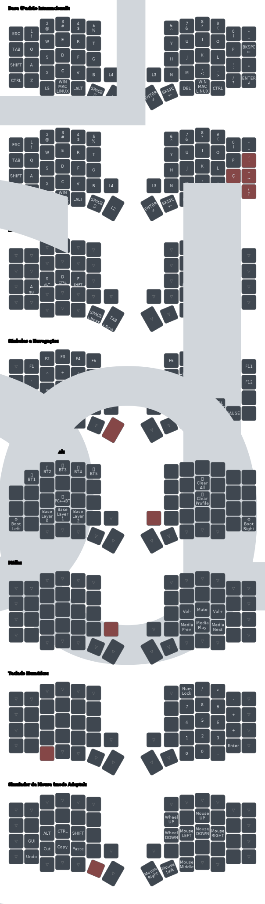

# Tergo Sofle - Versão Wireless - Manual de Usuário

## **Atenção: Versão sem fio**

Este manual é especificamente para a versão sem fio do teclado Tergo Sofle.

Se você adquiriu a versão com fio, veja o [manual da versão com fio](./MANUAL_TERGO_SOFLE.md).

## Resumo

Neste manual você vai saber os aspectos importantes para utilizar seu teclado Tergo Sofle.

> [!TIP]
>
> Veja o sumário de cada guia clicando no ícone de lista na parte superior direita da página - 

## Aproveite sua jornada!

Com um passo de cada vez, entenda cada aspecto do seu teclado.

Os guias te ajudarão e estão super detalhados, para que você desfrute do máximo potencial de cada aspecto do seu teclado.

## Instalação

- Conecte o receptor do teclado ao seu computador;

- Ligue as metades do teclado empurrando as chaves laterais para frente.

### Adicione o teclado ao seu sistema operacional

O teclado por padrão segue o padrão internacional, mas pode ser usado também no padrão ABNT2 (mais abaixo te mostraremos).

Para que seja reconhecido no seu computador, você precisa adicionar o layout de teclado internacional.

[Clique aqui](https://www.youtube.com/watch?v=UWwcIcwkPlA) para ver um breve vídeo de como fazer isso no Windows 11, por exemplo.

## Recarga e Baterias

### Duração

A bateria de cada metade do teclado tem recarga com duração estimada em 1 a 2 meses considerando uso diário de 8 horas e sem desligar.

### Descanso automático

Após 15 minutos sem ser usado, o teclado entra em modo de "sono profundo", que diminui o consumo de bateria. Ele é acordado na próxima interação com o teclado.

### Recarga

> [!IMPORTANT]
> Para recarregar:
> - Deixe a chave na posição de ligado (para frente)
> - Conecte o USB à metade do teclado que será carregada
>
> Enquanto estiver carregando corretamente, uma luz azul próxima à entrada do USB permanecerá ligada. 
>
> Quando a carga total for atingida, ela irá desligar.

A carga total é atingida dentro de 1 hora. 

Recarregue ambas metades conforme necessário.

> [!WARNING]
>
> Tome cuidado para não forçar a chave lateral de liga/deliga para não quebrá-la acidentalmente.

> [!TIP]
>
> Por mais que desligar as metades do teclado enquanto não estiver em uso possa contribuir com a duração da carga,
> a diferença tende a ser pouco relevante dado a presença do descanso automático do teclado.
>
> Nesse caso, torna-se dispensável desligar as metades do teclado no dia a dia durante o uso recorrente.
>
> Recomenda-se desligar as metades para os casos de:
> - Deixar o teclado parado ou guardado por um tempo
> - Levar o teclado para viajens ou enviá-lo pelo correio
> - Realizar manutenções e o abrir

## Layout de teclas

### Padrão (Internacional)


As teclas com a letra `L` seguida de um número (como o `L2`) indicam teclas que ao serem seguradas mudam a camada de teclas do seu teclado.

O conceito de camada de teclas será explicado mais abaixo neste manual.

### Como fazer acentos e teclas especiais?

Para acentos agudos, no padrão internacional, basta clicar a tecla de aspas e então a letra que quer.

Para o `Ç`, clique na tecla de aspas e na letra `C`.

Para o símbolo de til (`~`), segure a tecla `Fn` (tecla do dedão esquerdo) e clique `A`. Em seguida, você pode largar a tecla segurada e clicar na letra que deseja.

Para o símbolo grave (``` ` ```), segure a tecla `Fn` (tecla do dedão esquerdo) e clique `Q`. Em seguida, você pode largar a tecla segurada e clicar na letra que deseja.

[Clique aqui](https://youtu.be/r9vUzQyXdps?t=142) para ver um breve vídeo que demonstra como usar teclas no padrão internacional.

### Mudar para o padrão brasileiro ABNT2

Caso prefira, você pode mudar para o padrão ABNT2.

Note que o layout de teclas padrão do seu teclado é o Internacional.

Caso queira usar o seu teclado com layout no padrão Português (Brasil) ABNT2, [clique aqui](./guias/especifico_versao_wireless/COMO_USAR_LAYOUT_PORTUGUES_BRASIL_ABNT.md) para saber como.

Mudando para o padrão brasileiro, as teclas abaixo em vermelho são as que mudam em relação ao layout internacional que vem por padrão.


## ZMK Studio: Software para configuração


O teclado usa a interface para configurações em tempo real [ZMK Studio](https://zmk.studio/).

Você pode utilizar o [ZMK Studio no próprio navegador](https://zmk.studio/) ou [baixar o aplicativo](https://github.com/zmkfirmware/zmk-studio/releases) para seu sistema operacional. 

Abra o ZMK Studio e selecione seu teclado para fazer customizações. As modificações são feitas em tempo real.

### Acessar o ZMK Studio

> [!IMPORTANT]
>
> Após abrir o ZMK Studio e selecionar seu teclado, você verá uma mensagem na sua tela pedindo para "desbloquear" seu teclado.
>
> Para isso:
> - 1: Segure a tecla para acessar a camada de ajustes (conforme exemplo abaixo)
> - 2: Clique na tecla `ESC` (tecla mais superior à esquerda no teclado)
>
> Consulte o exemplo abaixo.


### Sobre o ZMK Studio

Aproveite e já abra o ZMK Studio, e navegue pelas camadas de teclas para entender a posição de cada tecla em cada camada. Não se assuste, é mais simples do que parece.

Com o [ZMK Studio](https://zmk.studio/), você tem funcionalidades diversas. Algumas das principais que você provavelmente utilizará são:

- Ver o mapeamento de cada tecla;
- Modificar o que cada tecla faz;
- Modificar camadas;
- Entre outros.

> [!NOTE]
> O ZMK Studio é uma tecnologia muito recente e vem aos poucos lançando novidades.
>
> Algumas customizações ainda não podem ser feitas diretamente por ele e requerem programação.
>
> Você pode aprender a como modificar o código-fonte do seu teclado consultando o guia de [customização do código-fonte](./guias/especifico_versao_wireless/COMO_MODIFICAR_CODIGO_FONTE.md).
>
> O que o ZMK Studio suporta hoje e o que está previsto de funcionalidades pode ser visto [clicando aqui](https://zmk.dev/docs/features/studio#capabilities).
>
> Fique por dentro de atualizações que a Tergo Teclados lançar para ter a versão mais atual do seu software sempre disponível.

## Camadas de teclas

O sistema de camada de teclas faz com que todas as teclas do teclado estejam acessíveis em outras camadas.

Perceba que diversas teclas especiais, a princípio, não se encontram na camada base do seu teclado, mas sim em outras camadas. Essas teclas podem ser: símbolos especiais, F1-F12, botões de navegação e setas.

Isso justamente porque esses botões costumam ficar em posições mais distantes, que requerem bastante movimento para serem alcançadas.

Com o sistema de camada de teclas, elas ficam mais próximas de você, a uma camada de distância.

É parecido como a tecla Shift funciona no seu teclado tradicional. Quando você segura o Shift, as teclas que são números assumem uma nova funcionalidade: símbolos. E as letras normais viram maiúsculas.

A diferença é que você pode programar o que quer ver em cada camada: configure uma tecla para mudar de camada e configure o que você quer de teclas nessa camada.

Use a interface do ZMK Studio para entender facilmente o conteúdo de cada camada e use a foto de exemplo abaixo para se guiar!

As camadas que já vem com o seu teclado são:
- camada base
- símbolos e navegação
- controle de mídia
- simulador de mouse
- teclado numérico
- ajustes

Veja o exemplo abaixo:



### Restaurar configurações originais

Caso tenha realizado customizações pelo ZMK Studio, 
você pode restaurar para as configurações originais no próprio ZMK Studio.

Para isso, clique em `Tergo Sofle` (no topo da tela) e, em seguida, em `Restore Stock Settings`.

### Modo básico e adepto

O modo básico e adepto são simplesmente aplicações do sistema de camada de teclas.

O Tergo Sofle vem configurado de forma que você pode escolher entre 3 camadas base, ou seja, a camada que fica ativa quando você não está com nenhuma outra camada ativa, ou seja, onde estão suas letras e números convencionais.

Essas camadas são as de número 0, 1 e 2 (que podem ser visualizadas facilmente no ZMK Studio).

A camada 0, também chamada de "Basic", é a padrão.

A camada 1, também chamada de "Adept", é uma extensão da camada 0, que vem configurada com novas funcionalidades especiais mais avançadas.

A camada 2 é uma camada extra para você modificar do jeito que quiser. É uma cópia da camada 0.

### Funcionalidades que já vem configuradas no modo adepto (camada 1)

O modo adepto muda qual é a camada base. 

Você pode colocar o que quiser na camada que corresponde ao modo adepto (camada 1), mas ela é chamada assim pois já vem com funcionalidades interessantes configuradas que devem tornar sua experiência de digitação ainda mais avançada.

Essas funcionalidades consistem de teclas com comportamentos especiais que visam uma experiência ainda mais ergonômica e avançada de digitação. Em destaque, ele adiciona teclas com:

- Duplo comportamento para a tecla espaço (também conhecido como Tap-Hold) para ir à camada do simulador de mouse se segurada;

- Comportamento Tap-Hold nas teclas da Home Row para utilização de modificadores.

Não se assuste! Te explicamos tudo. Um passo por vez.

Recomenda-se que você explore o restante do manual e, em seguida, o [guia de como digitar com ergonomia](./guias/COMO_DIGITAR_COM_ERGONOMIA.md), e que se adapte ao teclado antes de você experimentar essas funcionalidades do modo adepto.

> [!NOTE]
> Alterar entre o modo básico e adepto não é persistente, voltando ao modo básico caso o teclado seja reiniciado.

## Atalhos no teclado

Algumas configurações são feitas no próprio teclado.

Estando na camada de ajustes (por padrão segurando a tecla do lado direito abaixo da região coberta), você conta com atalhos para opções diversas.

Além disso, você pode visualizar o mapeamento de todas essas teclas e modificar pela interface do ZMK Studio.


### Alterar camada base

Enquanto na camada de ajustes, altere entre as 3 possíveis camadas base configuradas clicando X, C ou V.

### Alterar entre dispositivos conectados

O Tergo Sofle Wireless suporta conectar e controlar individualmente múltiplos dispositivos que possuem _Bluetooth_.

Você pode, por exemplo, usar o teclado no seu computador e, eventualmente, trocar o foco dele para seu notebook ou smartphone para responder alguém.

Entenda a funcionalidade e como utilizá-la vendo o guia de [como conectar multiplos dispositivos](./guias/especifico_versao_wireless/COMO_CONECTAR_MULTIPLOS_DISPOSITIVOS.md).

## Cuidados com seu teclado

> [!IMPORTANT]
>
> Tenha atenção em relação aos seguintes pontos:
> - Forçar as chaves laterais de ligar/desligar
> - Forçar os conectores USB superiores ao conectar cabos
> - Líquidos perto do seu teclado
> - Desmontar o teclado sozinho (consulte o [manual de montagem e manutenção](./guias/MANUAL_DE_MONTAGEM_E_MANUTENCAO.md) caso queira fazer isso)

> [!NOTE]
> O teclado Tergo foi feito para ser durável e facilmente renovável.
>
> Entretanto, ninguém quer presenciar defeitos no seu produto por conta de potenciais mal usos.

## Como digitar com o teclado Tergo

Este guia é o próximo que você deve seguir após ler este atual.

Visite o [guia de como digitar com ergonomia](./guias/COMO_DIGITAR_COM_ERGONOMIA.md) e entenda as maneiras ideais de utilizar seu teclado Tergo.

## Atualizar firmware

A Tergo Teclados pretende lançar futuramente melhorias no Firmware do teclado e você deve ser notificado disso. 
Para atualizar o firmware, consulte o [guia de como atualizar o firmware](./guias/especifico_versao_wireless/COMO_ATUALIZAR_FIRMWARE.md).

## Modificar manualmente o _firmware_

Isto aqui é considerado um tópico avançado, para você que tem interesse em programar e modificar diretamente o código-fonte do seu teclado.

Existem modificações mais específicas que a interface ZMK Studio ainda não oferece mas que podem ser modificadas no próprio _firmware_. Isso vai requerer conhecimento em programação e baixar softwares.

No guia de funcionalidades do teclado é comentado o que já é suportado pelo software ZMK Studio e o que ainda não é.

Para se aventurar no mundo de modificação do _firmware_, use o [Manual de Modificação do Firmware](./guias/especifico_versao_wireless/COMO_MODIFICAR_CODIGO_FONTE.md).

## Próximos passos

Vá para o [guia de como digitar com ergonomia](./guias/COMO_DIGITAR_COM_ERGONOMIA.md) e descubra a maneira recomendada para digitar.

## Contato

Caso não consiga suprir sua dúvida com a documentação ou esteja tendo dificuldade, a Tergo está sempre disponível para te ajudar.

[Mande mensagem para o WhatsApp da Tergo clicando aqui (+5548992173491)](https://wa.me/5548992173491?text=Oi%2C+preciso+de+ajuda+em+rela%C3%A7%C3%A3o+%C3%A0+documenta%C3%A7%C3%A3o+do+teclado+Tergo.)
