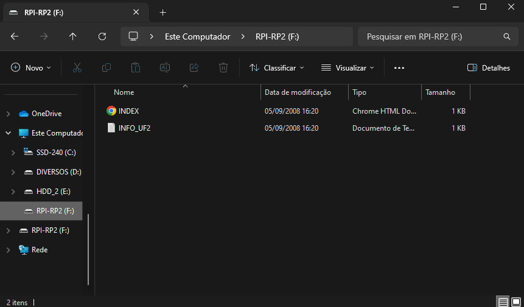

# Manual de Atualização do Firmware

A Tergo Teclados pretende continuar realizando melhorias no _firmware_ do teclado. Para atualizá-lo é fácil, basta seguir as instruções aqui presentes.

> [!TIP]
>
> Veja o sumário de cada guia clicando no ícone de lista na parte superior direita da página - 

## Para que atualizar o firwmare?

Alguns motivos do porquê você pode querer atualizar o firmware:

- Trocar entre a versão ABNT2 ou Internacional
- Instalar uma atualização nova do firmware fornecida pela Tergo Teclados
- Colocar sua versão customizada do firmware

## Visualizar versão atual

Caso você possua telas OLED, você pode ver a versão do firmware do seu teclado indo para a camada de ajustes e visualizando a tela OLED direita, na parte superior.

## Baixar firmware

Sempre que houver um lançamento de uma nova versão do firwmare, ela será publicada no [repositório do Firwmare](https://github.com/TergoTeclados/vial-qmk-firmware/releases).

Baixe a versão mais recente do firwmare para garantir que você está em dia com as atualizações.

Basta clicar no arquivo com final do tipo `.uf2` para baixá-lo.

> [!IMPORTANT]
>
> Baixe o arquivo referente ao layout desejado de teclas: no padrão internacional ou no padrão ABNT2.
>
> Caso deseje utilizar o padrão ABNT2, consulte o guia de [como utilizar o layout brasileiro](./COMO_USAR_LAYOUT_PORTUGUES_BRASIL_ABNT.md).

## Salvar customizações atuais do Vial

Caso tenha customizações que realizou no Vial e pretende mantê-las, você precisa salvá-las no seu computador, pois atualizar o _firmware_ retornará seu teclado para as configurações de fábrica.

Para isso, você precisa da [versão desktop do aplicativo do Vial](https://get.vial.today/download/) para salvar seu layout atual.

Clique em "File > Save current layout" (ou use o atalho `Ctrl+S`), e o salve em uma pasta no seu computador. Ele será carregado novamente após atualizar seu teclado.

## Colocar firmware no teclado

Cada metade do teclado conta com uma placa controladora independente, que pode ser acessada a partir do USB **superior** de cada metade. É a partir dele que atualizaremos cada metade para uma nova versão do _firmware_.

> [!IMPORTANT]
> Atenção às entradas USB que serão usadas para atualizar o firmware: são as entradas superiores de cada metade do teclado.
> As entradas USBs das laterais servem puramente para a comunicação entre as metades do teclado.

### Gravar o lado esquerdo

- Inicialmente, desconecte o cabo que conecta o teclado ao computador, que fica conectado à parte superior do teclado.

- Mantenha pressionada a tecla superior mais à esquerda (que por padrão é o `ESC`) e conecte novamente o cabo energizado. [Este breve vídeo](https://www.youtube.com/watch?v=cs2bDVUJNUQ) mostra este passo.

- Ao largar a tecla, uma pasta deve se abrir no seu computador, conforme exemplo mais abaixo, indicando que seu teclado entrou em modo de _boot_.

- Copie ou mova o arquivo do _firmware_ para a pasta que abriu.

Após isso, a pasta deve sumir automaticamente, indicando que a placa controladora reiniciou.

### Gravar o lado direito

Agora, você ainda usará o cabo USB que está conectado ao seu computador para gravar o lado esquerdo.

Dessa vez, ele será conectado na entrada USB superior da metdade direita do teclado, que é onde fica a placa controladora.

Faça os mesmos passos que o lado esquerdo, porém agora para o lado direito, sendo que dessa vez a tecla a ser pressionada é a mais superior à direita.

> [!IMPORTANT]
> O USB para atualizar o lado direito, assim como é para o esquerdo, é o que fica na parte superior do teclado, e não os laterais.
> Os USBs laterais servem apenas para a comunicação entre as metades do teclado.

## Importar configuração do Vial

Por fim, opcionalmente, importe de volta seu layout salvo para o Vial clicando em "File > Load saved layout"

## Alternativa: abrir modo de gravação de forma física

Se você não consegue mais ativar o modo de gravação (bootloader) por meio dos atalhos do teclado, pode ser que você:

- Gravou firmware customizado que não foi configurado para ativar o modo de gravação.

A solução para isso é ativar o modo de gravação de forma física:

- Abra a tampa superior do seu teclado;
- Procure pelo botão de reset: entre as colunas que ficam os parafusos;
- Com o teclado conectado por cabo, clique brevemente 2 vezes nesse botão para ativar modo de gravação.

> [!TIP]
>
> Utilize a chave philips do kit de manutenção para abrir a tampa e a parte de trás dela para pressionar o botão.

### Não tenho o botão! E agora?

Algumas versões mais antigas do teclado Tergo Sofle (antes da 1.2.2) não possuem o botão.

Nesse caso, procure pelos 2 furos acima da região do USB **lateral**. Eles estarão marcados pela letra **R**, simbolizando "Reset".

- Pegue um clips metálico (o que usa para prender papel mesmo);
- Segue ele e, com a ponta dele, toque o clips metálico brevemente 2 vezes no **furo de cima**.
