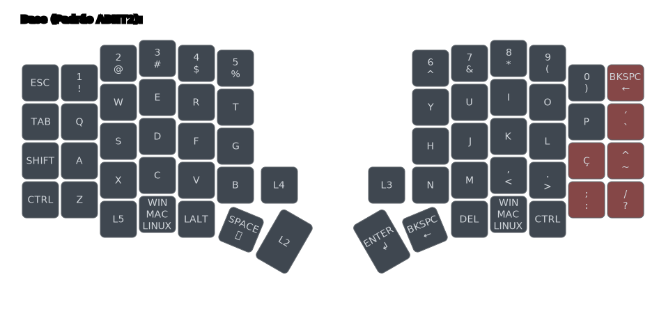

# Como usar layout em Português (Brasil) ABNT2

## Resumo

Este guia vai te ensinar a como utilizar o layout de teclas do seu teclado no padrão Português (Brasil) ABNT2, ou seja, com teclas como "Ç" e outros acentos na camada base.

> [!TIP]
>
> Veja o sumário de cada guia clicando no ícone de lista na parte superior direita da página - 

## Alterar layout para português Brasil ABNT2

### Exemplo layout ABNT2

Nós fornecemos também um layout no padrão ABNT2 para quem está mais familiarizado. As teclas em vermelho são as que mudam em relação ao layout internacional.

### Como mudar para o padrão ABNT2

> [!IMPORTANT]
>
> Resume-se a realizar 2 configurações:
> - Gravar o _firmware_ da versão ABNT2 no seu teclado
> - Garantir que o teclado do seu computador está configurado para o padrão ABNT2

1 -  Baixe o _firmware_ da versão abnt2, presente [na página do firmware](https://github.com/TergoTeclados/vial-qmk-firmware/releases/). Basta clicar no arquivo para baixá-lo.

> [!TIP]
>
> O arquivo terá um nome semelhante a `firmware_tergo_sofle_vxxx_abnt2.uf2`

2 - Grave o _firmware_ no seu teclado. Para isso, basta seguir o guia de [como atualizar o firmware](./COMO_ATUALIZAR_FIRMWARE.md).

3 - Abra o aplicativo do Vial com seu teclado conectado e selecione seu teclado.

4 - Vá para o menu `Keyboard layout` e selecione a opção "Brazilian", para que o Vial mostre corretamente as teclas.

5 - Garanta que o layout de teclado do seu sistema operacional seja "Português (Brasil ABNT2)".

Se o seu dispositivo por padrão já utiliza um teclado no padrão ABNT2, você provavelmente não precisará realizar esse passo.

Além disso, no Windows, caso haja mais que um layout de teclado configurado, você provavelmente verá o seguinte no canto inferior direito da sua tela, na barra de tarefas:

Está pronto! Experimente digitar e se guie pela interface do Vial para entender claramente o que cada tecla faz.
