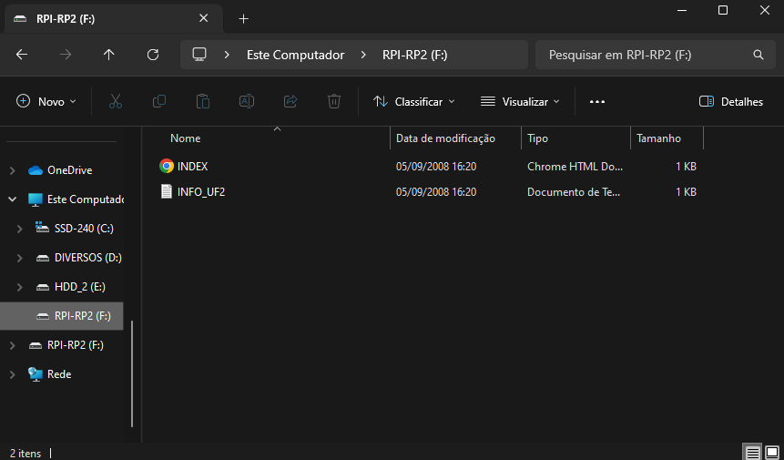

# Manual de Atualização do Firmware

A Tergo Teclados pretende continuar realizando melhorias no _firmware_ do teclado. Para atualizá-lo é fácil, basta seguir as instruções aqui presentes.

## Visualizar versão atual

Você pode ver a versão do firmware do seu teclado indo para a camada de ajustes e visualizando a tela OLED direita, na parte superior.

## Baixar firmware atualizado

Sempre que houver um lançamento de uma nova versão do firwmare, ela será publicada no [repositório do Firwmare](https://github.com/TergoTeclados/vial-qmk-firmware/releases) e cada usuário notificado.

Baixe a versão mais recente do firwmare para garantir que você está em dia com as atualizações.

Basta clicar no arquivo com final do tipo `.uf2` para baixá-lo. Por exemplo: `firmware_tergo_sofle_v1_xx.uf2`.

## Salvar customizações atuais do Vial

Caso tenha customizações que realizou no Vial e pretende mantê-las, você precisa salvá-las no seu computador, pois atualizar o _firmware_ retornará seu teclado para as configurações de fábrica.

Para isso, você precisa da [versão desktop do aplicativo do Vial](https://get.vial.today/download/) para salvar seu layout atual.

Clique em "File > Save current layout" (ou use o atalho `Ctrl+S`), e o salve em uma pasta no seu computador. Ele será carregado novamente após atualizar seu teclado.

## Colocar firmware no teclado

### Gravar o lado esquerdo

- Inicialmente, desconecte o cabo que conecta o teclado ao computador.

- Mantenha pressionada a tecla superior mais à esquerda (que por padrão é o `ESC`) e conecte novamente o cabo energizado. [Este breve vídeo](https://www.youtube.com/watch?v=cs2bDVUJNUQ) mostra este passo.

- Ao largar a tecla, uma pasta deve se abrir no seu computador, conforme exemplo mais abaixo, indicando que seu teclado entrou em modo de _boot_.

- Copie ou mova o arquivo do _firmware_ para a pasta que abriu.

Após isso, a pasta deve sumir automaticamente, indicando que a placa controladora reiniciou.

### Gravar o lado direito

- Faça os mesmos passos que o lado esquerdo, porém agora para o lado direito, sendo que a tecla a ser pressionada é a mais superior à direita.

## Importar configuração do Vial

Por fim, opcionalmente, importe de volta seu layout salvo para o Vial clicando em "File > Load saved layout"
