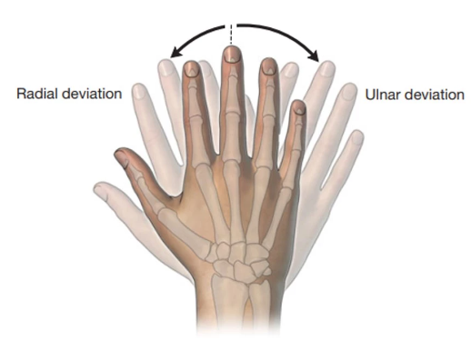
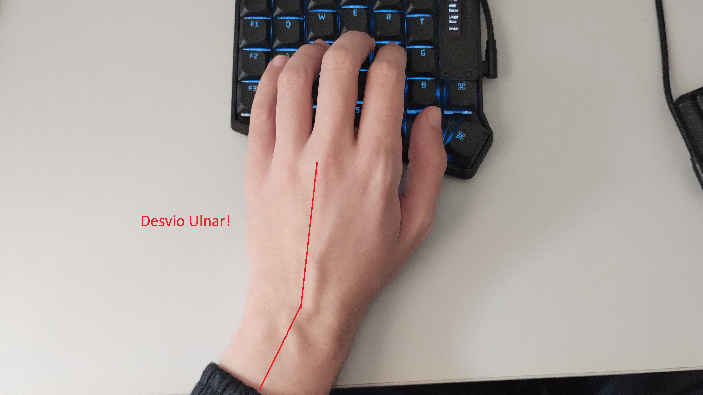
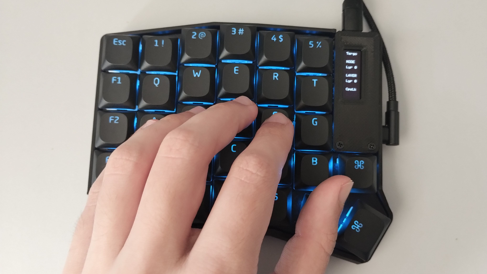

# Tergo Sofle - Manual de Ergonomia

Este manual visa discutir aspectos de ergonomia focados na digitação e maneiras recomendadas de aprender a digitar com o Tergo.

## Atenção

### Parte da ergonomia é entender o que é confortável para seu corpo

Todos temos corpos e equipamentos diferentes. Caso os conselhos que você encontra aqui possam parecer não fazer sentido, procure entender o porquê deles e soluções que melhor se adequem ao seu corpo.

### Isenção de Responsabilidade

Antes de qualquer dica e informação sobre ergonomia que eu possa te passar, é importante destacar que não possuimos especialista com formação em área médica nem fisioterapia. Recomenda-se que se consulte um especialista na presença de qualquer problema de saúde para o devido laudo médico.

As explicações e dicas que podemos te oferecer neste momento são baseadas em leituras, relatos e experiências de pessoas com problemas de dores, dentre eles que consultaram médicos e encontraram a solução de seus problemas na melhoria de hábitos, melhores periféricos (como o teclado Tergo), e fisioterapia.

## Postura no Uso do Computador

Se você chegou até aqui, provavelmente já viu aquelas imagens que demonstram a maneira ideal de se sentar em frente ao computador. A imagem abaixo (retirada [daqui](https://fisiomedcuiaba.com.br/dicas-importantes-para-sentar-corretamente-em-frente-do-computador/)) é só um exemplo de inúmeras páginas que mostram maneiras recomendadas de se posicionar.

## Qual a melhor forma de posicionar cada lado do teclado Tergo?

O incrível dos lados serem divididos é que você possui muitas possibilidades para achar a posição ideal e mais confortável para sua digitação.

Não há uma verdade absoluta de qual o melhor posicionamento. Varia conforme diversas variáveis, como a maneira que você está sentado, distância da mesa, entre outros.

Mas o que você deve ficar atento quando posicionar os lados é:
- Manter a mão reta em relação ao antebraço, ou seja, evitar desvio ulnar e radial que pode gerar fadiga e pressão nos nervos do pulso; 
- Garantir que consiga manter boa postura no computador ao digitar.

### Desvio Ulnar e Radial: evitar!

Ao posicionar a mão no teclado para digitar, queremos mantê-la neutra em relação ao antebraço, para evitar o desvio radial e ulnar que podem causar pressão nos nervos do pulso.

Desvio ulnar e radial são os movimentos mostrados pela imagem abaixo.

Abaixo estão exemplos de como não posicionar e outro de como posicionar.

### Exemplos de posicionamento das mãos

2 principais exemplos de posicionamento sugeridos são:

- lados próximos, curvados para dentro;
- lados afastados.

### Lados próximos

Acima os lados estão próximos. Repare que os curvei para dentro, pois assim evito desvio ulnar e radial. Além disso, ocupa pouco espaço.

### Lados afastados

Acima os lados estão afastados. Dessa forma, consigo me encostar na cadeira e usar os apoios de braço, por exemplo.

#### Onde coloco o mouse?

Com os lados afastados, uma metade pode ficar onde estaria normalmente o mouse. Nesse caso, você pode experimentar usá-lo entre os lados ou mais para fora, por exemplo.

## Posicionamento para digitação com o Tergo

Considerando que você entendeu como se posicionar corretamente na sua cadeira, vamos discutir maneiras recomendadas de utilizar o teclado Tergo Sofle.

### Posicionamento dos braços

A maneira recomendada de posicionar seus braços é com:
- Ombros relaxados;
- Seus braços devem estar posicionado de forma parecida com a imagem anterior de modo que você não sinta que seus músculos do ombro estejam sustentando seus braços abertos (o que deve gerar fadiga);
- Aproximadamente 90 graus entre o braço e antebraço.

### Posicionamento dos dedos e mãos

Posicione seus dedos na "home row", ou seja, seus indicadores nas teclas com relevo: F e J. Isto é, mão esquerda com dedos nas teclas A, S, D, F, e a direta nas teclas J, K, L, ;.

Perceba que ao posicionar idealmente os dedos nessas teclas, especialmente o mindinho, você estará com a ponta dos dedos tocando a superfície das teclas e com a mão curvada para dentro, como se fosse uma garra.

Exemplo dos dedos nas teclas conforme sugerido anteriormente.

Por outro lado, pode ser que você prefira deixar a mão mais alongada e pressionar as teclas com a região da digital dos dedos. A consequência disso é que o mindinho, em especial, ficará mais para baixo da tecla onde ele deveria normalmente estar, ou seja, provavelmente ficando mais perto da tecla com letra Z do que da letra A.

Exemplo da mão mais estendida. Note a posição em que o mindinho ficou.

#### Polegares

Dependendo do tamanho das suas mãos o polegar irá cair naturalmente sob uma das teclas dos dedões. Em especial, a penúltima.

Experimente pressionar essa tecla com o seu dedão. Experimente pressioná-la com diversas regiões do dedão (da lateral próximo da ponta até a junta) para entender qual exige menos força e qual se adapta melhor para você.

Abaixo é um exemplo de onde meu dedão fica normalmente.

Repare que uso a região do meio do dedo, próximo à articulação, para pressionar a tecla, pois sinto que é o mais confortável para mim.

Uma outra dica para evitar que você perca referência de qual tecla seu dedão está durante a fase de adaptação à digitação nele é substituir a keycap dessa tecla pela tecla "5" que vem em kits de keycaps que incluem teclado numérico, pois essa tecla possui um relevo (assim com as teclas F e J) que ajudará você a se guiar.

## Como digitar

### Touch Typing

"Touch Typing" é vista como a maneira recomendada de digitar mesmo em teclados convencionais. Resume-se a digitar sem olhar para o teclado e com 1 ou 2 colunas dedicadas para cada dedo da mão (exceto polegares). É um equilibrio entre aproveitar a maiora dos dedos das mãos e ter velocidade.

Ao mesmo tempo, é importante destacar que variações dessa técnica podem funcionar até melhor para cada um. Você verá mais detalhes nas dicas mais abaixo.

### Pratique Touch Typing!

Recomendo ler este guia inteiro e usá-lo também como referência enquanto pratica.

Caso não tenha aprendido a digitar dessa maneira (ou mesmo que tenha) recomendamos que pratique online no site https://www.typingclub.com/.

Você pode experimentar alguns exemplos básicos e também pular direto para mais avançados.

## Dicas e curva de aprendizado

### O Uso do Mindinho em Touch Typing

Dependendo da maneira que você posiciona seus dedos nas teclas, você vai reparar que os mindinhos podem ter dificuldade de alcançar certas teclas, como o "Q" e "P". Isto é notável na foto mais acima que mostra a mão posicionada de forma extendida, na sessão de [posicionamento dos dedos e mãos](#posicionamento-dos-dedos-e-mãos).

Uma alternativa é optar pelos dedos anelares para alcançarem essas teclas, reposicionar as mãos no teclado, ou digitar com flutuação das mãos.

### Experimente flutuar as mãos

Mesmo o teclado sendo pensado para que as teclas fiquem todas ao alcance das mãos, você pode reparar que, para alcançar certas teclas, caso você mantenha os pulsos apoiados na mesa e dependendo do posicionamento da sua mão nas teclas, seus dedos podem fazer movimentos estranhos e seus pulsos rotações. Por exemplo: você pode ter que esticar muito ou retrair muito o dedo para alcançar as teclas mais a cima e mais abaixo em uma mesma coluna.

Quando você digita flutuando as mãos, ou seja, sem apoiar os pulsos na mesa enquanto digita, o movimento dos pulsos se torna mínimo e você passa a responsabilidade para alcançar certas teclas para o movimento dos braços.

Por isso, **é interessante misturar as técnicas de Touch Typing com a flutuação das mãos**.

<i>Caso queira mais embasamento teórico do porquê disso, [este artigo](https://www.tifaq.org/articles/keyboard_retraining-junjul99-kahan&griffin.html) discute sobre como flutuar as mão faz mais sentido e trás mais vantagens do que apoiar os pulsos e seguir restritamente as regras de Touch Typing.</i>

#### Isso não vai deixar meus braços cansados?

Caso você siga os conselhos da maneira ideal de posicionar seus braços em relação ao seu corpo, seus músculos do braço estarão sendo minimamente forçados.

Além disso, na prática, passamos boa parte do tempo pensando e deixando os braços relaxados na mesa, então o tempo efetivo que você estará digitando é menor.

### Curva de aprendizado

Minha experiência e de diversos outros usuários em relação a se adaptar ao design do Tergo Sofle costuma relatar que em cerca de 1 mês você volta a digitar na velocidade que digitava antes de começar a utilizar o teclado ergonômico.

Você não precisa fazer a mudança imediata de parar de usar o seu teclado convencional e usar 100% do tempo o Tergo. Na primeira semana é normal que você tenha uma velocidade de digitação mais lenta.

Nas primeiras práticas, a tendência é você se acostumar com o posicionamento das teclas e entender com quais dedos você pressionará cada uma.

Depois disso, acaba sendo questão de gerar mais memória muscular para criar velocidade.

O sistema de camadas de teclas também requer prática para seu cérebro se acostumar com o posicionamento de cada tecla nas outras camadas.

Há diversos relatos de usuários que começaram a usar teclados ergonômicos divididos e aprenderam a digitar corretamente. Um exemplo recente que vi foi o seguinte:

_"Quando mudei (de teclado), coloquei algo para ouvir em segundo plano e fiz testes de digitação de 20 a 40 minutos por dia. Eu sei que parece chato pra caramba, mas é meio pacífico e meditativo. Em cerca de duas semanas, eu estava totalmente proficiente. Pode levar mais ou menos tempo, mas compare isso com o tempo que você levou para aprender a digitar quando era criança e usou um computador pela primeira vez. Um pouco de dedicação no início compensa muito rapidamente."_

_Comentário traduzido [dessa postagem](https://www.reddit.com/r/ErgoMechKeyboards/comments/1ed0i6j/this_is_embarrassing/)._

#### Como treinar

Uma sugestão é fazer diariamente treinos de digitação com Touch Typing como dito na sessão de ["pratique touch typing"](#pratique-touch-typing), de 10 minutos por exemplo, caso queira ter uma mudança gradual.

### Vou esquecer como usar um teclado tradicional?

Não! Seu cérebro cria memória muscular de como utilizar ambos teclados. A mudança entre eles requer um pequeno momento para ele relembrar como utilizar corretamente cada layout.

Mas mesmo assim você pode levar seu Tergo para onde quiser e sempre ter as vantagens de utilizá-lo com você, dado ser compacto e compatível com qualquer sistema.

### Sistema de Camada de Teclas

Lembre-se de que você pode configurar as teclas de todas camadas usando o Vial. Assim, adapte as camadas de teclas para o que ficar mais confortável para você.

Mas quando criar ou modificar alguma camada de teclas tenha em mente a seguinte dica: é interessante deixar os botões utilizados com mais frequência o mais próximo possível da home row, pois assim você minimizará o movimento das mãos e dedos para alcançar essas teclas.

## Inclinação dos Lados

Inclinar os lados diminui a tensão nos antebraços e pulso causadas pela pronação das mãos. É muito interessante de experimentar. Segundo relatos lidos, também pode fornecer alivio imediato para quem já possui problemas ou dores decorrentes da digitação tradicional, assim como mouses verticais.

### Fica mais dificil de digitar?

Não necessariamente. A maior diferença é que inclinar os lados faz com que de maneira geral o teclado fique mais alto e assim você precisa ajustar a altura das mãos.

Além disso, caso você não queira digitar flutuando as mãos, os apoios de pulsos oferecem um ótimo suporte e altura.

## Apoios de pulso

Apoios de pulso podem ser um tópico controverso.

Os maiores pontos são relacionados às consequências de como você usa eles:
- apoiar os pulsos ao invés de digitar flutuando
- pressão causada no pulso

### Apoiar os pulsos ao invés de digitar flutuando

Isso pode ter as mesmas consequências que simplesmente apoiar os pulsos na mesa, que é você se acostumar a não mover as mãos e alcançar teclas distantes de modo que geram desvio ultar e radial.

### Pressão causada no pulso

Caso você use os apoios diretamente sob o pulso, pode ser que você esteja aplicando pressão no nervo que fica no pulso, que é algo que pode vir a gerar problemas.

### Usar ou não usar

Além de ótimos para descansar as mãos quando não está digitando, eles tem potencial de serem confortáveis caso você prefira digitar mantendo as mãos apoiadas de maneira fixa.

Experimente posicionar os apoios nas palmas, no pulso ou nos antebraços e entender o que funciona para você.

## Ergonomia e bons hábitos em geral

### Alongamentos e descansos!

Um bom equipamento ergonomico contribui para o conforto do seu trabalho durante as longas jornadas do dia-a-dia, porém não deixa de haver a necessidade de pausas para alongamentos e descansos.

Faça pausas, alonge seu corpo. Faça alogamentos para os tendões das suas mãos e braços. Procure massagens para aumentar o fluxo sanguíneo nas suas mãos e pulso.

E claro, exercícios e bons hábitos de vida tendem a contribuir para sua vida em geral.

Não me aprofundarei neste tópico dado não ser especialista da área médica, mas cuide do seu corpo e saúde, mesmo que seja para prevenir de problemas que você ainda não tem.

#### Alongamento rápido para minimizar problemas de síndrome do túnel de carpo e tendinite

[Este video que mostra um alongamento de 2 minutos a ser feito diariamente](https://youtu.be/fdD7CgN5FGg?t=129) se demonstra popular nas comunidades de ergonomia. É simples de fazer, basta criar o hábito e compromisso. Porém existem muito mais vídeos como esse que valem ser assistidos.

### Controvérsia do Uso do Apoio de Braço da Cadeira

É comum o apoio de braço das cadeiras ser vendido como algo ideal para apoiar os braços durante a digitação. Porém pode ser muito pelo contrário.

O ideal para seus braços é: ombros relaxados, braços próximos ao corpo, e aproximadamente 90 graus entre o braço e antebraço. 

Experimente fazer isso, sem os apoios de braço, apoiando suas mãos na mesa e deixando seu corpo e cadeira próximos à mesa. A princípio você deve perceber como isso parece natural.

Os problemas principais que você pode perceber com apoios de braço são: 
- Impedem que você consiga aproximar sua cadeira para a mesa (eles podem bater na mesa);
- São lateralmente distantes e forçam você a levantar um pouco horizontalmente seus braços para conseguir apoiar neles;
- Você não consegue apoiar o antebraço inteiro nele e acaba botando mais pressão no cotovelo (potencial causador da Síndrome do Túnel Cubinal)

Experimente usar sua cadeira com e sem apoio de braços. Entenda o que funciona para você em relação a conforto e preste atenção nos pontos colocados aqui.

Entenda também, caso você use os apoios de braço, se está dependente dele ou se usa ele apenas para descansar. Ou seja, perceba se você está apoiando seu corpo neles ou apenas deixando seus braços relaxarem neles.

## Modificações e Funcionalidades que Contribuem para Ergonomia

O próximo passo da sua jornada é o [Guia de Modificações e Funcionalidades que Contribuem para Ergonomia](MODIFICACOES_E_FUNCIONALIDADES_QUE_CONTRIBUEM_PARA_ERGONOMIA.md).

Nele, você descobrirá como diversas funcionalidades como modificar o layout de teclas ou teclas especiais da tecnologia utilizada pelo Tergo Sofle podem te fornecer uma experiência de digitação mais otimizada e aplicando ideias de ergonomia.

### Busque entender o que funciona para você

Cada usuário tem uma experiência diferente e cada um encontra um layout ou forma de digitar que funciona de forma mais ou menor confortável para seu corpo e uso diário.

O incrível do Tergo Sofle é que ele pode ser usado de muitas maneiras diferentes e com muitas customizações diferentes, sempre com potencial de renovar sua forma de digitar.

A forma certa de usá-lo, no fim, varia para cada usuário.
Busque entender o que funciona para você.
