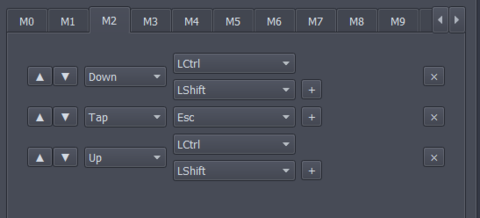
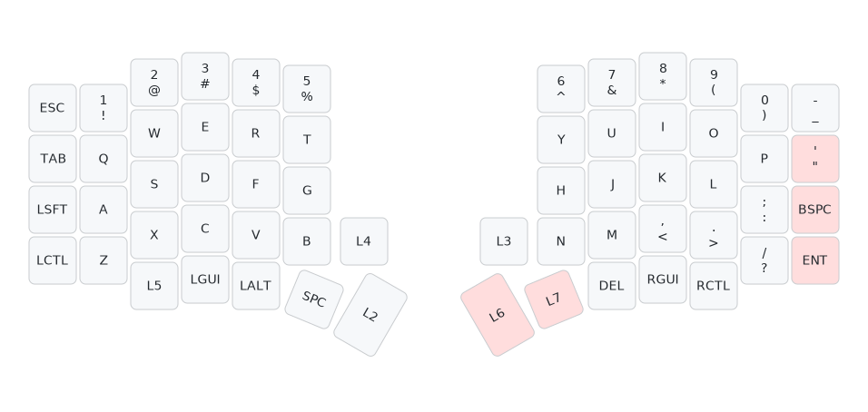
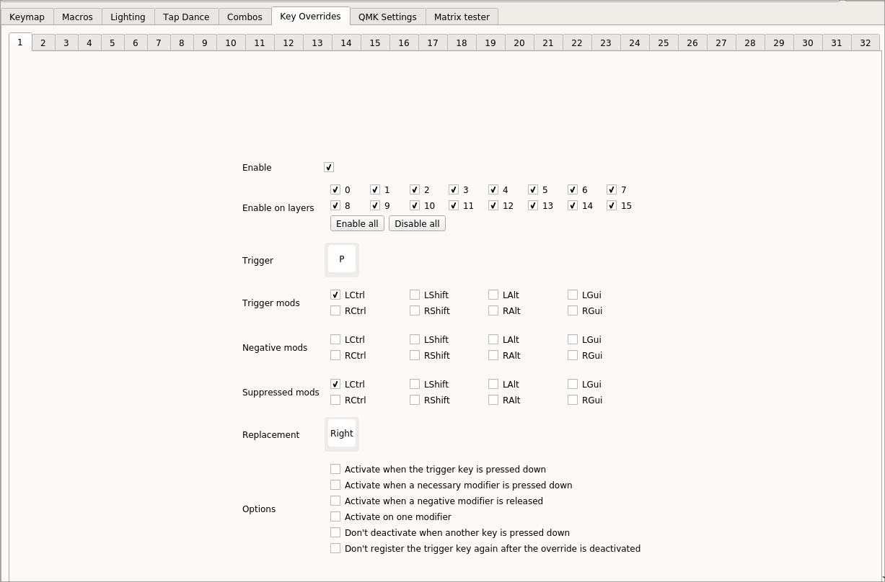
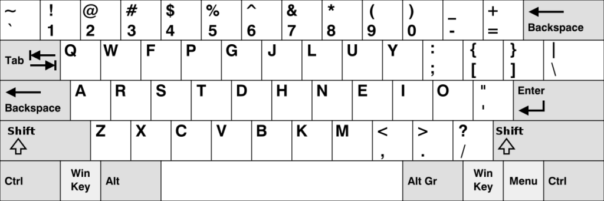

 # Guia - Modificações e Funcionalidades que Contribuem para Ergonomia

Neste guia você descobrirá como diversas funcionalidades como modificar o layout de teclas ou teclas especiais da tecnologia utilizada pelo Tergo Sofle podem te fornecer uma experiência de digitação mais otimizada e aplicando ideias de ergonomia.

## Sumário

  * [Adapte o layout de teclas para suas necessidades](#adapte-o-layout-de-teclas-para-suas-necessidades)
  * [Reposicionar teclas de forma que as teclas mais frequentes fiquem próximas da "home row"](#reposicionar-teclas-de-forma-que-as-teclas-mais-frequentes-fiquem-próximas-da--home-row)
    + [Home Row Mod](#home-row-mod)
  * [Minimizar o número de passos necessários para realizar uma ação](#minimizar-o-número-de-passos-necessários-para-realizar-uma-ação)
    + [Tecla + modificador em um só clique](#tecla--modificador-em-um-só-clique)
    + [Macros](#macros)
    + [Combos](#combos)
      - [Ideias de combos](#ideias-de-combos)
  * [Sugestões de adaptações no layout do Tergo Sofle](#sugestões-de-adaptações-no-layout-do-tergo-sofle)
    + [Tirar Backspace e Enter dos dedões](#tirar-backspace-e-enter-dos-dedões)
    + [Criar camadas dedicadas](#criar-camadas-dedicadas)
    + [Teclas com duplo comportamento](#teclas-com-duplo-comportamento)
    + [Colocar duplo comprtamento nas teclas extras abaixo das telas](#colocar-duplo-comportamento-nas-teclas-extras-abaixo-das-telas)
    + [Colocar duplo comportamento nas teclas do dedão para mudar de camada](#colocar-duplo-comportamento-nas-teclas-do-dedão-para-mudar-de-camada)
  * [Layouts de teclas além do QWERT](#layouts-de-teclas-além-do-qwert)
    + [Layout de teclas QWERT](#layout-de-teclas-qwert)
    + [Layout de teclas Dvorak](#layout-de-teclas-dvorak)
      - [Layout de teclas Colemak](#layout-de-teclas-colemak)
  * [Layout popular otimizado para poucas teclas: Miryoku](#layout-popular-otimizado-para-poucas-teclas-miryoku)
  * [Próximos passos](#próximos-passos)

## Adapte o layout de teclas para suas necessidades

Procure entender que teclas você usa com mais frequência e posicioná-las estrategicamente de forma que seja confortável de usá-las.

Utilize a interface do Vial para mudar o conteúdo de cada camada de teclas.

A principal dica para ter em mente ao modificar o layout das suas teclas para algo mais otimizado para você é que teclas as mais frequentemente utilizadas devem exigir o mínimo de esforço para serem digitadas.

Isso pode ser alcançado aplicando 3 conceitos:
- Reposicionar teclas de forma que as teclas mais frequentes fiquem próximas da "home row';
- Minimizar o número de passos necessários para realizar uma ação;
- Trocar o dedo escolhido para apertar a tecla.

## Reposicionar teclas de forma que as teclas mais frequentes fiquem próximas da "home row"

O exemplo mais básico para você aplicar esse ponto pode ser rearranjar o posicionamento de símbolos na camada de símbolos e navegação.

Experimente trocar teclas da camada de forma que fique otimizado para que você tenha os símbolos que você usa com mais frequência pertos da home row, que é onde seus dedos descançam normalmente. 

Assim, você minimiza a necessidade de ter que movê-los ao entrar na camada para digitar essas teclas.

### Home Row Mod

Um exemplo de aplicação muito popular desse conceito é o "home row mod", que adiciona duplo comportamento às teclas da "home row" (que são as teclas `A, S, D, F` e `J, K, L, ;`), de forma que:
- Clicá-la te fornece o caracter (como esperado normalmente) 
- E segurá-la faz com que ela funcione como um modificador: SHIFT, CTRL, ALT e WIN/CMD.

Esta é uma funcionalidade que já vem configurada na camada do modo Adepto (camada 1). Experimente mudar o teclado para o modo adepto, como explicado no [manual do usuário](../MANUAL_DO_USUARIO.md#alterar-camada-base). Então, por exemplo, segure a letra `F` (que assim se comportará como se você estivesse segurando o `Shift`) e clique em uma letra, como a `U`, para ter o caracter maiúsculo.

Com isso, você não precisa mover os dedos para alcançar esses modificadores que normalmente ficam nas laterais do teclado.

_Como isto funciona é explicado com mais detalhes no próximo guia (o de [funcionalidades avançadas](./TOPICOS_AVANCADOS.md#home-row-mod))._

## Minimizar o número de passos necessários para realizar uma ação

### Tecla + modificador em um só clique

Se você usa com muita frequência alguma funcionalidade, como, por exemplo "Ctrl + Seta para o lado" (que resulta em pular uma palavra para a esquerda ou direita), você pode programar uma tecla para fazer esses passo com um só clique, na própria interface do Vial.

Há um exemplo disso aplicado na camada de símbolos e navegação (camada de número "3" no Vial). Repare nas teclas abaixo de onde seriam as setas (Left e Right).

Para fazer o que foi feito no exemplo acima, você pode usar as teclas especiais disponível no submenu "Quantum". 

Para entender o que cada tecla desse menu faz, você pode (apenas no aplicativo baixado do Vial) manter o mouse em cima que aparece uma dica flutuante. Ou então, [consultar este trecho da documentação oficial do firmware QMK](https://github.com/qmk/qmk_firmware/blob/master/docs/keycodes.md#modifiers-modifiers), que é o utilizado.

### Macros

Com a ajuda de macros, você pode ser ainda mais criativo.

Macros simulam sequências de ações, como pressionar teclas específicas simultaneamente ou uma após a outra.

Há vários exemplos de aplicaçõe que você pode ver na [documentação do Vial sobre macros](https://get.vial.today/manual/macros.html#examples).

Um exemplo mostrado é abrir o gerenciador de tarefas do Windows, por exemplo, por meio de segurar o `Ctrl`+`Shift` e clicar `ESC`:

Você pode criar macros pelo submenu "Macros" no software Vial.

### Combos

Clique duas ou mais teclas ao mesmo tempo e tenha como resultado uma outra tecla.

Um exemplo de aplicação é fazer com que pressionar 2 teclas ao mesmo tempo resultem em teclas especiais como Enter, Backspace, ou mesmo Capslock.

#### Ideias de combos

Experimente, por exemplo, fazer um macro que ative Capslock ao clicar `R` e `U`, que são 2 teclas que sempre estão próximas aos seus dedos.

Ou então,

que tal `W`+`E`+`R` para ativar o `espaço` e `U`+`I`+`O` para ativar o `backspace`?

Você pode criar combos pelo submenu "Combos" no software Vial.

Saiba mais vendo a [documentação do Vial sobre combos](https://get.vial.today/manual/combos.html).

(Mais detalhes sobre isso em breve)

## Sugestões de adaptações no layout do Tergo Sofle

### Tirar Backspace e Enter dos dedões

Pode ser que você prefira utilizar a tecla "backspace" e/ou "enter" com algum dedo que não seja o dedão. 

Dessa forma, você pode colocá-lo(s), por exemplo, na coluna direita, de forma que sejam alcançáveis pelo seu dedo mindinho ou anelar, e usar a nova tecla disponível do dedão, por exemplo, para acessar uma nova camada com símbolos e funcionalidades úteis pra você.

O exemplo abaixo é uma aplicação disso.

As teclas marcadas em vermelho foram as alteradas em relação ao layout original do Tergo Sofle.

### Criar camadas dedicadas

Complementando o exemplo acima que resultou em novas teclas para o dedão, que tal criar novas camadas?

Você pode criar uma camada só para números (ou deixar a camada do teclado numérico mais facilmente alcançável) de forma que você não precisa usar os números da linha de teclas superior do seu teclado.
Com eles vagos, você pode colocar novas funcionalidades para cada uma dessas teclas superiores, por exemplo.

### Teclas com duplo comportamento

Essa é uma das funcionalidades mais úteis e interessantes do teclado Tergo.

Como funciona: ao clicar, você tem a tecla. Ao segurar, ela faz outra coisa, como, por exemplo, mudar de camada. 

Veja os exemplos abaixo.

### Colocar duplo comportamento nas teclas extras abaixo das telas

Por padrão, há 2 teclas abaixo da região das telas que servem para mudar a camada do seu teclado: uma vai para a camada de mídia ao ser segurada, e a outra para a camada de ajustes, conforme foto abaixo.

Que tal modificarmos para que, quando eu apenas clicar nelas (ao invés de segurar) elas façam alguma outra coisa? 

Como, por exemplo, uma pode ser usada para ativar o CapsLock. A outra para tirar _print_ da tela.

Para isso, ficamos com o exemplo abaixo:

Para fazer isso, basta ir para o submenu de teclas `layers` e colocar no lugar das teclas a tecla `LT` seguida do número da camada de destino que você quer que seja ativada ao segurar a tecla.

Em seguida, você poderá escolher qual tecla por padrão será ativada ao simplesmente clicar a tecla.

### Colocar duplo comportamento nas teclas do dedão para mudar de camada

Que tal adicionar duplo comportamento para as teclas mais próximas do seu dedão: `espaço` e `backspace`.

Repare nessas teclas comentadas no exemplo abaixo.

Há 2 exemplos disso no Vial na camada 1 (modo adepto), nas teclas do dedão esquerdo. Use-os como referência.

Mas resumidamente, para fazer isso, abra o submenu de teclas "Layers" e coloque no lugar da tecla que você quer substituir o botão com nome `LT` seguido de um número que representa a camada de destino que você quer ativar ao segurar a tecla. Em seguida, escolha a tecla que será ativada caso você simplesmente clique a tecla.

### Substituir uma sequência de teclas por  outra tecla

Uma das desvantagens de utilizar camadas é a necessidade de não poder reutilizar a tecla pressionada como modificador.
Suponha que uma de suas camadas seja ativada ao apertar a tecla *Control*, caso deseje executar atalhos como *Control C* ou *Control v* comuns em diversas aplicações não seria possível sem utilizar combos, *Tap-Dance* ou substituindo a tecla na interface do *Vial* por *Any*.

Se você for um usuário mais experiente pode ser que *Any* seja uma solução aceitável, mas para usuários iniciantes consultar [código de teclas](https://docs.qmk.fm/features/command) pode prejudicar o período de adaptação. Utilização de *Tap-Dance* é sensível a latência da sua digitação e combos são fáceis de errar o "timing" , assim como nos games de Luta 😞 [demonstração do combo ](https://www.youtube.com/shorts/MjQF17hFAzg).

A solução para esses casos é utilizar a funcionalidade de [key overrides](https://docs.qmk.fm/features/key_overrides) 

#### Compreendendo *trigger, suspended e negative mods*

Para compreender tais modificadores considere o seguinte exemplo, uma "camada" de navegação.

Ao apertar e segurar *Control e h* seria como se tivesse sido apertado a *seta esquerda(⬅️)* do teclado.

Ao apertar e segurar *Control e l* seria como se tivesesse sido apertado a *seta direita(➡️)* do teclado.

Ao apertar e segurar *Control e k* seria como se tivesesse sido apertado a *seta para cima(⬆️)* do teclado.

Ao apertar e segurar *Control e j* seria como se tivesesse sido apertado a *seta para baixo(⬇️)* do teclado.

esse tipo de remapeamento pode ser bastante útil nos casos que já existem atalhos de teclado pré-configurados
como por exemplo os de navegação no gerenciador de tarefas ou até mesmo no seu navegador, nesses casos tais atalhos podem não ser reconfiguráveis.

então o que essencialmente queremos é que ao pressionarmos e não soltar *Control* ao apertar uma das teclas mencionadas,(h,j,k,l) tenhamos accesso as "teclas" e caso não deixemos soltar as teclas depois do *Control* que continue parecendo que estamos apertando as setas do teclado.

Para que seja possível executar a primeira etapa do nosso remapeamento é preciso que *Control* seja tratado como uma tecla especial que "dirá" para o teclado que o remapeamento é possível a partir do momento quue a tecla é segurada, no caso do menu do Vial essa tecla está sendo tratada como um exemplo de **trigger  mod** ou seja ela o passo inicial para que o nosso remapeamento ocorra, segue um breve tutorial:

Clique no checkbox ao lado de *Enable*

Clique no quadrado ao lado de *Trigger* e selecione a tecla *h*

Clique na palavra *LCtrl* na linha que está localizado o nome *Trigger mods*

Clique no quadrado ao lado de *Replacement* e selecione a tecla *seta para esquerda*

agora teste algum dos remapeamentos, você notará que ao segurar *Control* e não soltar e depois apertar *h* o comportamento não é de uma seta para cima, isto se deve ao fato que a tecla Control está sendo considerada como pressionada depois de apertar *d*, que problema!

Mas há uma solução, **suppresed mods*** tais modificadores permitem que ao pressionar o *Control* e depois o *h*  o *Control* é ignorado e o resultado é o remapeamento como esperado 😄.

Clique na palavra LCtrl na linha que está localizado o nome Supressed mods.

Pronto agora repita o procedimento para as outras teclas e sua "camada" está pronta para uso em qualquer app que utilize atalho envolvendo seta de teclado como por exemplo *Alt ➡️, Shift ⬆️*, **note que esse método exibe uma desvantagem que pode ser significativa, as teclas Control h, Control j, Control k e Control l ficarão inutilizadas, sendo sempre substítuidas pelas setas de teclado**.

Como solução para o problema acima podemos aplicar um  **negative mod** evitando assim que um remapeamento aconteça se uma tecla modificadora esteja pressionada. 

Clique em qualquer tecla modificador na linha *Negative mods* que não seja *LCtrl*.

## layouts  de teclas além do QWERTY

Uma das aplicações da ideia de reposicionar as teclas como comentado [mais acima neste guia](#reposicionar-teclas-de-forma-que-as-teclas-mais-frequentes-fiquem-próximas-da-home-row) (e que exige mais sair da zona de conforto) é reposicionar as letras do seu teclado de forma a otimizar sua digitação.

A ideia por trás é super interessante, mesmo que não pretenda experimentar.

Já se perguntou o porquê do layout das suas teclas ser do jeito que ele é? Ou seja, por que os caracteres QWERT ficam um ao lado do outro, por exemplo?

### Layout de teclas QWERT

Não há uma resposta exata, mas foi algo que surgiu junto à máquina de escrever, e que foi historicamente herdado e é utilizado até hoje.

Ele não parece ter sido criado pensando em uma digitação otimizada e confortável.

Uma das teorias é que ele foi feito justamente para deixar o digitador mais lento, de forma a minimizar problemas nos mecanismos da máquina de escrever por digitar teclas muito próximas de forma rápida.

Visto isso, há diversos layouts criados pensando em otimizar a digitação. Vou te resumir 2 principais populares.

### Layout de teclas Dvorak

 

Antigo, criado em 1930 por Dvorak, mas já trazia melhorias em relação QWERT, com a ideia de minimizar movimentos estranhos para combinações normalmente usadas de teclas.

#### Layout de teclas Colemak

Criado em 2006. Pega pontos positivos do Dvorak e do QWERT, e otimiza posicionamento das teclas baseado na língua inglesa.

_Fonte e mais detalhes comparando no site: https://typingdonewell.com/blog/dvorak-vs-colemak-in-depth-comparison-with-my-own-tests/_

## Layout popular otimizado para poucas teclas: Miryoku

Um layout altamente popular na comunidade de teclados ergonômicos é o [Miryoku](https://github.com/manna-harbour/miryoku/tree/master/docs/reference#layers).

Ele foi pensado para usar pouquissimas teclas, utilizando altamente do sistema de camadas de teclas e teclas com duplo comportamento.

A imagem abaixo é pouco legível mas mostra, para cada cor, a funcionalidade que a tecla assume em determinada camada.

Caso queira ver cada camada individualmente para se inspirar e entender melhor, [clique aqui](https://github.com/manna-harbour/miryoku/tree/master/docs/reference#layers).

## Próximos passos

Considera-se que você já leu o manual do usuário, entendeu como digitar com  ergonomia e leu este manual.

Quando estiver ficando confiante com sua digitação ou caso queira entender melhor funcionalidades ainda mais avançadas, que podem inclusive contribuir para seu conforto, leia o [guia de tópicos avançados](./TOPICOS_AVANCADOS.md) para entender a fundo funcionalidades presentes especialmente no modo adepto do seu teclado.
