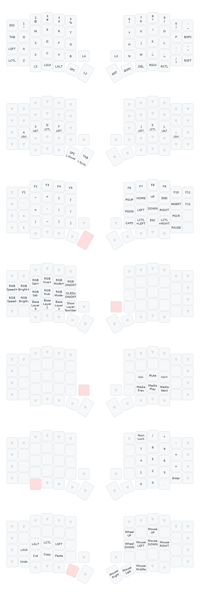

# Manual sobre Sistema de Camadas de Teclas

Este manual visa te ajudar a entender o sistema de camadas.

É bem mais simples do que parece, mas possibilita infinitas possibilidades com seu teclado!

Por agora, consulte o [Manual de Usuário](./MANUAL_USER.md#camadas-de-teclas).

## Camadas padrões que vem com seu teclado

As camadas que já vem com o seu teclado são:
- camada base
- símbolos e navegação
- controle de mídia
- simulador de mouse
- teclado numérico
- ajustes

Use a interface do Vial para entender facilmente o conteúdo de cada camada, e modifique como ficar mais confortável para você!

