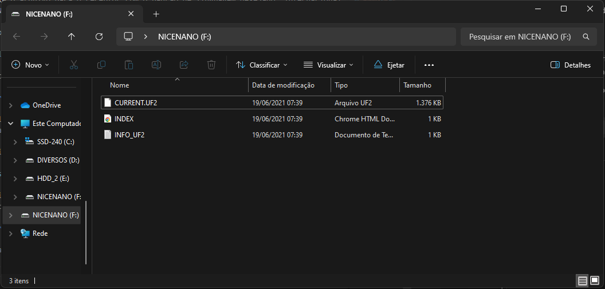

# Manual de Atualização do Firmware - Versão Wireless

A Tergo Teclados pretende continuar realizando melhorias no _firmware_ do teclado. Para atualizá-lo é fácil, basta seguir as instruções aqui presentes.

> [!TIP]
>
> Veja o sumário de cada guia clicando no ícone de lista na parte superior direita da página - 

## Vídeo sobre o processo

Fizemos um vídeo que resume parte do passo a passo abaixo que pode ajudar você:

[Veja no Youtube](https://youtu.be/1R6661NIb30)

## Para que atualizar o firwmare?

Alguns motivos do porquê você pode querer atualizar o firmware:

- Trocar entre a versão ABNT2 ou Internacional
- Instalar uma atualização nova do firmware fornecida pela Tergo Teclados
- Colocar sua versão customizada do firmware
- Usar um novo receptor para o teclado

## Baixar firmware atualizado

Sempre que houver um lançamento de uma nova versão do firwmare, ela será publicada no [repositório do Firmware](https://github.com/TergoTeclados/zmk-config-tergo-sofle/releases) e cada usuário notificado.

Baixe a versão mais recente do firwmare para garantir que você está em dia com as atualizações.

Basta clicar em cada arquivo do tipo `.uf2` para baixar cada um.

> [!IMPORTANT]
> Baixe o arquivo para o receptor com o padrão de linguagem desejado: internacional ou ABNT2.
>
> Escolha apenas um deles para gravar no seu receptor.

## Colocar firmware no teclado

O processo de gravação do _firmware_ no teclado consiste em colocar em modo de gravação e copiar e colar o arquivo do firmware de reset e então o arquivo de firmware dessa parte do teclado que precisa ser atualizada.

> [!NOTE]
>
> Atualizar o _firmware_ não irá remover as customizações que você realizou no teclado pelo ZMK Studio. Isso é feito diretamente no painel do ZMK Studio.

### Grave primeiro o firmware de reset, e então o da parte do teclado

Antes de gravar o _firwmare_ do teclado em sua respectiva parte, grave primeiro o firmware de reset.

Ou seja, a sequência para gravar o firmware é:

`Colocar em modo de gravação -> Colocar o firmware de reset -> Colocar novamente em modo de gravação -> Colocar firmware da parte`

O único caso que você não vai precisar gravar o firmware de reset é caso esteja instalando uma customização que requer gravar apenas o firmware no receptor, como:
- Customizações que você mesmo fez no firmware;
- Atualizações no firwmare que a Tergo Teclados deixou explícito que basta atualizar o receptor.

## Como gravar o firmware

Primeiramente, desligue as metades do seu teclado.

Então, o processo é o seguinte:

1 - Copie o arquivo que será gravado no receptor: Primeiramente será o de reset, e, em uma segunda gravação, o do receptor.

2 - Com a parte do teclado a ser gravada conectada no computador, ative o modo de gravação dela.

> [!TIP]
>
> Isso é mostrado no [próximo tópico](#ativar-modo-de-gravação-de-cada-parte-fisicamente).

3 - Uma pasta chamada `NICENANO` se abrirá no seu sistema operacional. Caso não abra automaticamente na sua tela, você pode procurar no menu de dispositivos:

4 - Cole o arquivo copiado na pasta que abriu.

Após isso, a pasta sumirá automaticamente e seu dispositivo estará utilizando a nova versão do _firmware_.

5 - Repita o processo após gravar o firmware de reset para gravar o firmware da parte do teclado.

6 - Faça os mesmos passos para cada parte do teclado: receptor, metade esquerda e metade direita.

> [!IMPORTANT]
>
> Caso o teclado pare de responder a comandos após atualização, recomenda-se desligar e ligar todas as partes do teclado novamente.
>
> Desconecte e conecte novamente o receptor ao seu computador. Caso o teclado ainda não responda, desligue e ligue novamente as metades do teclado.
>
> Caso ainda assim, após tentar reiniciar todas as partes, o teclado não responda, repita todo o processo.

## Ativar modo de gravação de cada parte fisicamente

Para cada parte do teclado você precisará ativar o modo de gravação dela para gravar o firmware nela.

Há uma técnica para ativar o modo de gravação por meio de atalhos no teclado, mostrada [mais abaixo](#gravar-o-firmware-no-receptor---método-por-atalhos-no-teclado). Entretanto, ela é recomendada apenas para quem fez customizações no firmware e está atualizando apenas o receptor.

### Ativar modo de gravação das partes do teclado

**Para o receptor**

Ao olhar para o seu receptor, você notará que ele possui um pequeno buraco na parte debaixo. 

- Pegue um objeto metálico fino que possa ser inserido no buraco, como um _clipe_, uma pinça metálica, ou um pininho metálico

> [!TIP]
>
> Nós enviamos um _clipe_ com o teclado.

- Com o receptor conectado ao computador por cabo, toque brevemente 2 vezes na parte metálica vista nesse furo (normalmente dourada) com o objeto metálico

> [!NOTE]
>
> Às vezes 1 único toque, curto ou longo, basta para entrar em modo de gravação.
>
> Espere um breve intervalo para ver se a pasta abrirá.
>
> É normal que você não consiga de primeira, então tente novamente.

Caso você tenha feito isso com sucesso, deverá abrir a pasta de gravação do seu dispositivo no seu sistema operacional.

Grave o firwmare de reset, e então o firmware da partes específica do teclado.

**Para as metades do teclado**

Você precisará de acesso ao botão que está na placa eletrônica do seu teclado.

Para isso, você deverá abrir o protetor da placa controladora, que é a peça da parte de cima do teclado presa por 2 parafusos.

> [!TIP]
> Use a chave philips que acompanha seu teclado para abrir os parafusos.
>
> Remover apenas o parafuso que fica mais perto das teclas já te permite mover o protetor para o lado e ter acesso ao botão.

Assim, você encontrará um pequeno botão abaixo da chave de ligar/desligar.

Então, com a metade do teclado conectada ao seu computador por meio de cabo, pressione 2 vezes rapidamente o botão para o dispositivo entrar no modo de gravação.

Grave o firwmare de reset, e então o firmware da parte específica do teclado.

> [!TIP]
>
> Use a parte de trás da chave (parte plástica) para pressionar o botão com facilidade.

> [!NOTE]
>
> Às vezes 1 único clique, curto ou longo, basta para entrar em modo de gravação.
>
> Espere um breve intervalo para ver se a pasta abrirá.
>
> É normal que você não consiga de primeira, então tente novamente.

### Gravar o firmware no receptor - método por atalhos no teclado

Muitas vezes customizações ou atualizações requerem apenas atualizar o firmware do receptor.

Esse método de mostra como fazer isso por meio de atalhos no teclado.

O processo é o seguinte:

1 - Copie o arquivo que será gravado no receptor

> [!NOTE]
>
> Se for necessário aplicar o firmware de reset, ele será gravado primeiro, e depois o processo repetido com o firmware correto.

2 - Com o receptor do teclado conectado ao seu computador e o teclado em pleno funcionamento, coloque o receptor em modo de gravação clicando ao mesmo tempo as 4 teclas abaixo no seu teclado:

3 - Uma pasta chamada `NICENANO` se abrirá no seu sistema operacional. Caso não abra automaticamente na sua tela, você pode procurar no menu de dispositivos:

4 - Cole o arquivo copiado na pasta que abriu

Após isso, a pasta sumirá automaticamente e seu dispositivo estará utilizando a nova versão do _firmware_.

5 - Teste se o teclado funciona

> [!IMPORTANT]
>
> Caso o teclado pare de responder a comandos após atualização, recomenda-se desligar e ligar todas as partes do teclado novamente.
>
> Desconecte e conecte novamente o receptor ao seu computador. Caso o teclado ainda não responda, desligue e ligue novamente as metades do teclado.
>
> Caso ainda assim, após tentar reiniciar todas as partes, o teclado não responda, você provavelmente terá que aplicar o firmware de reset e gravar o firmware pelo método mais abaixo nesse guia: [como ativar o modo de gravação fisicamente](#ativar-modo-de-gravação-de-cada-parte-fisicamente).

### Gravar as metades do teclado

> [!NOTE]
>
> Caso você esteja realizando customizações no código-fonte do teclado por conta própria que alterem apenas o arquivo `sofle.keymap`, você geralmente só irá precisar atualizar o _firmware_ do receptor, pois é ele que gere a maioria das funcionalidades.

Agora, para cada metade do teclado, você gravará a versão mais recente do _firmware_.

Repita os passos abaixo para cada metade:

5 - Copie o arquivo do _firmware_ corresponde à metade do teclado que será atualizada (esquerda e então direita)

> [!IMPORTANT]
>
> Grave primeiro a metade esquerda, pois facilita possíveis resoluções de problemas.

6 - Com o teclado em funcionamento, conecte um cabo USB extra do seu computador à metade do teclado que será atualizada

7 - Coloque a metade do teclado em modo de gravação. Para isso, segure a tecla de acesso a camada de ajustes (marcada em vermelho na imagem abaixo) e pressione a tecla que ativa o modo de gravação da metade desejada: `Boot Left` caso você vá gravar a metade esquerda do teclado ou `Boot Right` caso seja a direita.

Ambas teclas estão localizadas respectivamente no canto inferior esquerdo e canto inferior direito, conforme imagem abaixo:

8 - Repita os passos (3) e (4), que é localizar a pasta que abriu e colar o arquivo do _firmware_ nela.

Repita para as metades do teclado.

> [!TIP]
>
> Caso você tenha alterado a camada de ajustes e/ou a localização da tecla `Bootloader` (que é a tecla que ativa o modo de gravação), você pode acessar o software ZMK Studio e alocar a tecla `Bootloader` temporariamente na metade do teclado que você pretende colocar no modo de gravação.

## Solução de problemas - teclado não responde após gravação

Caso seu teclado tenha parado de responder após atualizar alguma parte e você já tentou reiniciar individualmente cada parte, é provável que tenha acontecido algum dos itens abaixo:

- A atualização aplicada é disruptiva e ela requer a gravação prévia do _firmware_ de _reset_ ou ativação do modo de gravação fisicamente
- Você gravou o firmware de _reset_ na parte do teclado que parou de funcionar e ainda não gravou o firmware da parte após isso
- Você usou uma versão customizada por você do _firmware_ que contém algum erro

Para solucionar o problema, refaça o processo de gravação do firwmare fisicamente.
