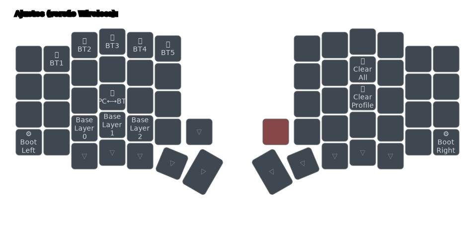

# Como conectar múltiplos dispositivos

## Visão Geral

O Tergo Sofle Wireless suporta conectar e controlar individualmente múltiplos dispositivos que possuem _Bluetooth_.

Você pode, por exemplo, usar o teclado no seu computador e, eventualmente, trocar o foco dele para seu notebook ou smartphone para responder alguém.

Por padrão, o Tergo Sofle suporta conectar até 5 dispositivos por meio de _Bluetooth_ + o seu dispositivo no qual o receptor está conectado.

> [!TIP]
>
> Veja o sumário de cada guia clicando no ícone de lista na parte superior direita da página - 

## Camada de ajustes

Na camada de ajustes você possui teclas especiais para manipular essa funcionalidade.

## Conectar dispositivo

> [!NOTE]
> Dispositivos móveis com tecnologia _Bluetooth_ (smartphones e tablets) tendem a conectar mais facilmente do que computadores. Assim, experimente primeiramente conectar no seu dispositivo móvel.

1 - Selecione um perfil que será responsável pelo dispositivo a ser conectado. Para isso, acesse a camada de ajustes e clique no botão referente ao `🛜BT1`, que é a tecla `1` no seu teclado, conforme imagem exemplo acima.

2 - Caso você já tenha tentado conectar ou tenha algum dispositivo conectado nesse perfil, limpe-o clicando na tecla `🛜Clear Profile`, que é a tecla `K` ao estar na camada de ajustes.

3 - No seu dispositivo _Bluetooth_ que você deseja conectar ao seu teclado, no menu de dispositivos _Bluetooth, desemparelhe o teclado caso você já tenha o emparelhado anteriormente.

> [!TIP]
> Geralmente há alguma opção chamada "esquecer dispositivo" ou "desemparelhar" que faz isso.

4 - Ainda no seu dispositivo _Bluetooth_, procure por dispositivos disponíveis para conexão. Busque por `Tergo Sofle` e clique nele.

> [!TIP]
> Caso você clique no dispositivo e, ao invés dele tentar conexão, ele se desconectar automaticamente ou nada acontecer, desligue e ligue novamente o receptor do seu teclado (desconectando e conectando novamente ao seu computador).

5 - Deve aparecer na tela do seu dispositivo um número ou senha que deve ser digitado **a partir do seu teclado Tergo** e, em seguida, clicado `Enter` para parear com sucesso.

Exemplo disso:
- Seu dispositivo mostra a senha `9217349`
- Você digita em sequência no seu teclado essa senha `9217349`
- Você clica `Enter` no seu teclado para enviar a senha

> [!TIP]
> Caso você erre a senha durante a conexão e não consiga tentar conectar novamente ao teclado, recomenda-se desligar e ligar novamente o receptor do seu teclado (para reiniciá-lo) e, opcionalmente, refazer todos os passos.

6 - Caso a senha tenha sido inserida com sucesso, o teclado deve se conectar automaticamente ao seu dispositivo. Agora, veja o próximo tópico para entender como alterar entre dispositivos.

## Alterar entre dispositivos

Caso você tenha algum dispositivo _Bluetooth_ já pareado:
- Você pode alternar o foco do seu teclado entre seu computador (dispositivo em que está conectado o repector) e dispositivos _Bluetooth_ clicando a tecla `🛜PC<->BT` no seu teclado, que consiste em acessar a camada de ajustes e clicar a letra `D`.
- Você pode alterar entre dispositivos _Bluetooth_ conectados acessando a camada de ajustes e clicando no dispositivo desejado (1, 2, 3, 4 ou 5).

### Outras funcionalidades

A tecla `🛜Clear All` limpa todas as configurações de todos dispositivos conectados. Assim, ao clicá-la (por padrão acessando a camada de ajustes e clicando `I`) você precisará conectar novamente todos dispositivos individualemnte.

> [!NOTE]
> Você pode entender mais sobre a funcionalidade de conectar múltiplos dispositivos oferecida pelo _firmware_ ZMK diretamente na [documentação oficial do ZMK](https://zmk.dev/docs/keymaps/behaviors/bluetooth#bluetooth-pairing-and-profiles).

## Receptor pode ser conectado a qualquer fonte 5V

- Você pode conectar o receptor do seu teclado a qualquer alimentação de 5V, como uma fonte de carregador de celular ou uma porta USB que está energizada;
- A partir disso, você pode conectar seus dispositivos por meio de bluetooth para o teclado, pois é o receptor que gerencia as conexões;
- Por fim, pelo próprio teclado, você pode alternar entre qual é o dispositivo que você quer digitar.
