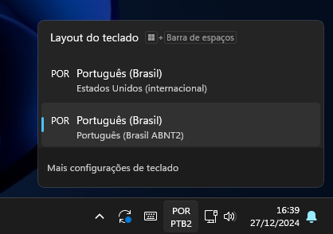

# Como usar layout em Português (Brasil) ABNT2

## Resumo

Este guia vai te ensinar a como utilizar o layout de teclas do seu teclado no padrão Português (Brasil) ABNT2, ou seja, com teclas como "Ç" e outros acentos na camada base.

> [!TIP]
>
> Veja o sumário de cada guia clicando no ícone de lista na parte superior direita da página - 

## Exemplo layout ABNT2

Nós fornecemos também um layout no padrão ABNT2 para quem está mais familiarizado. As teclas em vermelho são as que mudam em relação ao layout internacional.

## Como mudar para o padrão ABNT2

> [!IMPORTANT]
>
> Resume-se a realizar 2 configurações:
> - Uma no teclado
> - Uma no seu computador

### Atualizar firmware do teclado

1 - Baixe o arquivo de _firmware_ do receptor que contém o layout ABNT2 presente na [página do firmware da versão wireless](https://github.com/TergoTeclados/zmk-config-tergo-sofle/releases/). O nome do arquivo será algo semelhante a `sofle_receptor_abnt2.uf2`. Basta clicar no arquivo para baixá-lo. 

2 - Coloque o receptor do teclado em modo de gravação.

3 - Copie e cole o arquivo de _firmware_ baixado para dentro da pasta.

### Atualizar linguagem do teclado no seu computador

4 - Garanta que o layout de teclado do seu sistema operacional seja "Português (Brasil ABNT2)". Experimente clicar a tecla à direita da letra `L`, que deve resultar na letra `Ç` caso a lingua esteja corretamente configurada.

Caso não esteja corretamente configurado, você pode seguir [esse tutorial](https://tecnoblog.net/responde/como-configurar-o-teclado-de-um-notebook-windows-abnt-e-abnt2/) para adicionar a linguagem correta de teclado ao seu computador.

No Windows, caso você tenha mais que um layout de teclado, você provavelmente verá o seguinte no canto inferior direito da sua tela, na barra de tarefas:

Após isso está pronto! Experimente digitar e se guie pela interface do Vial para entender claramente o que cada tecla faz.

> ![NOTE]
>
> O software de customização ZMK Studio não mostrará como esperado teclas especiais como o `Ç`. Futuras atualizações devem corrigir isso.
>
> Use a imagem fornecida previamente do layout em português para se guiar.

### Por que botar em português duas vezes: uma no teclado e outra no sistema operacional?

Os teclados traduzem a tecla que você apertou em um código e o enviam para o computador.

O computador recebe uma mensagem do teclado e traduz baseado na linguagem do teclado configurado no sistema operacional.

O que acontece é que normalmente teclados não permitem que você mude a linguagem dele, e sim apenas configurar no sistema operacional.

No nosso caso, podemos configurar ambos.

O que fazemos então é garantir que ambos teclado e sistema operacional estão se comunicando na mesma linguagem.
