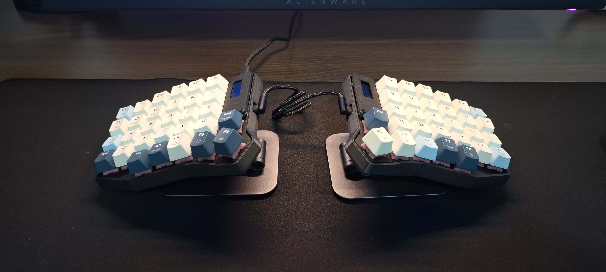
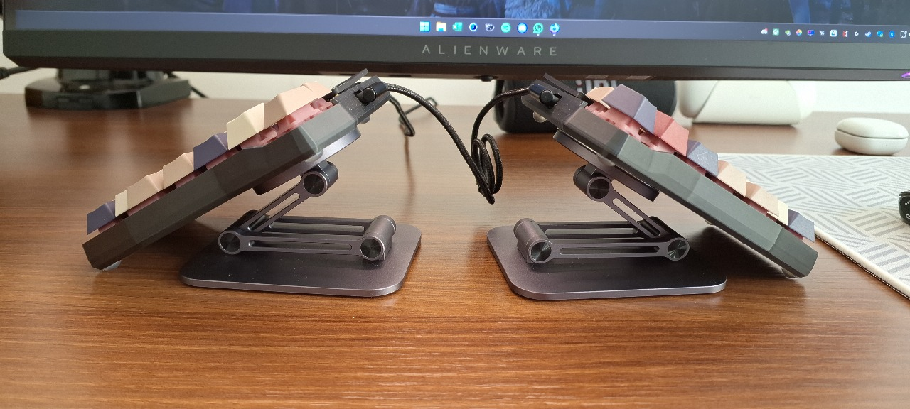
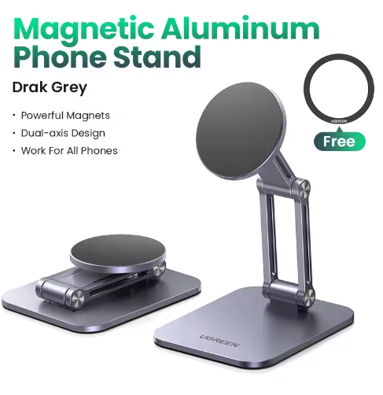

# Inclinar teclado ainda mais

A Tergo Teclados fornece soluções compactas e móveis para inclinar seu teclado e experenciar os benefícios trazidos por isso.

Entretanto, para alguns usuários, pode haver o desejo de experimentar niveis de inclinação ainda mais extremos, indo até inclinar o teclado em 90 graus.

Este guia vai sugerir uma outra maneira de inclinar seu teclado para atingir seu objetivo: utilizando suporte magnético de celular.

## Suporte magnético de celular

Consiste em adesivar uma parte magnética na parte de trás do teclado e utilizar o suporte para sustentá-lo.

### Vantagens
- Maior amplitude para inclinação

### Desvantagens
- Mais caro
- Menos compacto

## Onde obter e qual modelo

O modelo abaixo da UGREEN é uma das opções mais populares para isso, pois:
- Possui uma base grande estável;
- Permite um nível de ajuste interessante;
- Fornece anel magnético para colar embaixo do teclado.

Seu preço ronda cerca de R$150,00 importando pelo Aliexpress.

Lembrando que você precisará de 2 unidades.

[Clique aqui](https://pt.aliexpress.com/item/1005007890994823.html?spm=a2g0o.order_list.order_list_main.10.7da4caa4327n8K&gatewayAdapt=glo2bra) para visitar um anúncio no Aliexpress que contém o item. Outro link [aqui](https://pt.aliexpress.com/item/1005005590485850.html?spm=a2g0o.productlist.main.5.79db490apI8lhx&algo_pvid=117f0963-0f48-4e68-bc63-6fd4dd9e43ff&algo_exp_id=117f0963-0f48-4e68-bc63-6fd4dd9e43ff-4&pdp_ext_f=%7B%22order%22%3A%22379%22%2C%22eval%22%3A%221%22%7D&pdp_npi=4%40dis%21BRL%21239.96%21122.38%21%21%2140.94%2120.88%21%402101c5ac17498260572265379e6474%2112000039977717684%21sea%21BR%213754984627%21X&curPageLogUid=PvmrszPb9y4Q&utparam-url=scene%3Asearch%7Cquery_from%3A#nav-review).

> [!TIP]
>
> Uma vez por mês o Aliexpress costuma anunciar cupons de desconto na página principal, caso prefira aguardar por descontos.

