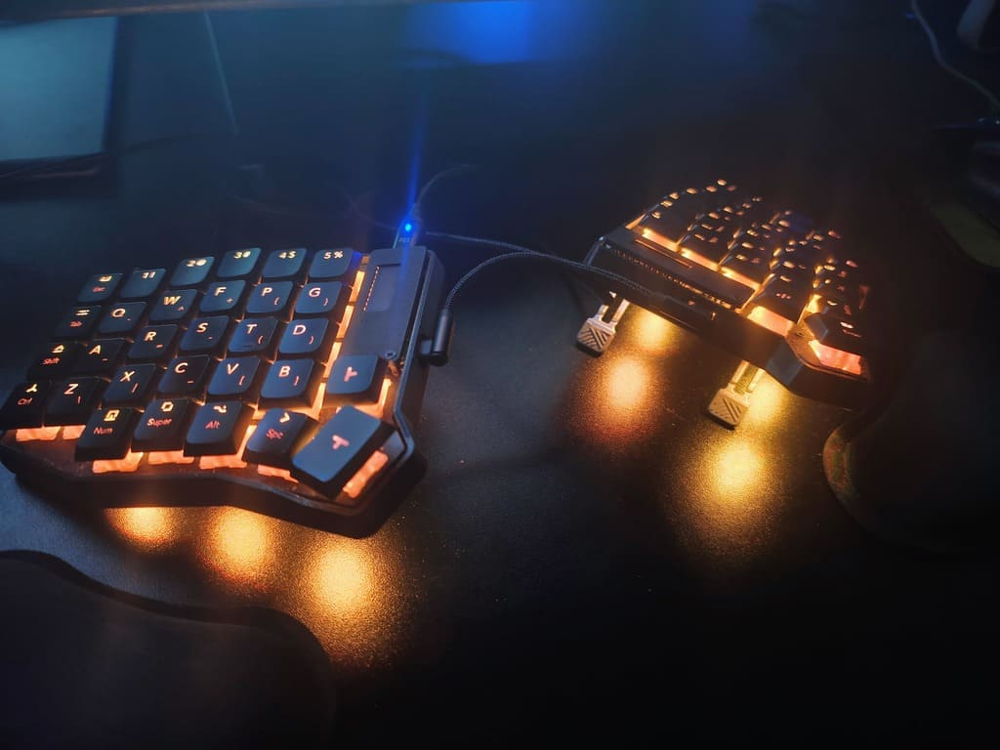
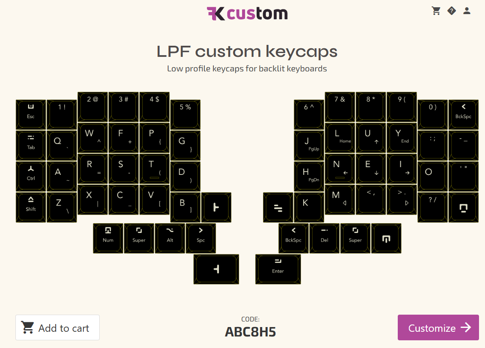

# Teclas customizadas (keycaps)

Esse guia visa falar sobre teclas (keycaps) customizadas para o Tergo Sofle.

A imagem abaixo é o teclado de um cliente que fez isso.

Nesse guia falaremos sobre pontos positivos e negativos e como você pode ter as suas próprias teclas customizadas.

## O que é possível de fazer com teclas customizadas

- Ter teclas customizadas com o símbolo e tamanho do seu interesse;
- Texto secundário nas teclas (veja a imagem).

## Vantagens

- Indicação visual de cada tecla, inclusive símbolos para teclas secundárias, como as da camada de símbolos.
- Visual único.

Isso pode te ajudar a se guiar principalmente nos primeiros dias com o teclado, caso prefira olhar para o teclado enquanto digita, o que não é recomendado.

## Desvantagens

- Se você customizar o que alguma tecla faz o texto pode parar de fazer sentido;
- Custo muito alto: **cerca de ~R$750,00 ($69 + ~70% de impostos)**;
- Pode estimular o mau hábito de olhar para o teclado enquanto digita;
- Tempo de entrega possivelmente longo (precisa passar pela alfândega e pagar impostos).

## Como encomendar suas teclas customizadas

A Tergo Teclados não fabrica teclas customizadas.

Entretanto, indicamos um site para os clientes adquirirem suas próprias diretamente.

Você pode adquirir para nosso endereço para montarmos seu teclado com elas ou mandar para seu próprio endereço para você mesmo encaixá-las.

### Layout customizado semipronto do Tergo Sofle

No site **FK Caps** você pode adquirir teclas customizadas e editar cada tecla.

Nosso cliente compartilhou conosco a configuração que fez para suas teclas (muito obrigado por contribuir para a comunidade!).

Você pode usar ela como um inicio e customizar de acordo com seu gosto, ou adquirir elas diretamente.

[Clique aqui](https://fkcaps.com/custom/ABC8H5) para visitar o layout customizado.

> [!WARNING]
>
> Revise o layout para ver se todas as teclas estão de acordo com o esperado e customize conforme necessário.
>
> O layout de teclas no site FK Caps não é mantido pela Tergo Teclados.

> [!IMPORTANT]
>
> Ao comprar, o valor no site não incluirá impostos.
>
> Quando chegar no Brasil, será retido na alfândega e cobrados impostos para liberação.
>
> Recomendo acompanhar o código de rastreio ou até baixar o aplicativo do Correios para monitorar sua encomenda e pagar os impostos assim que notificado.

